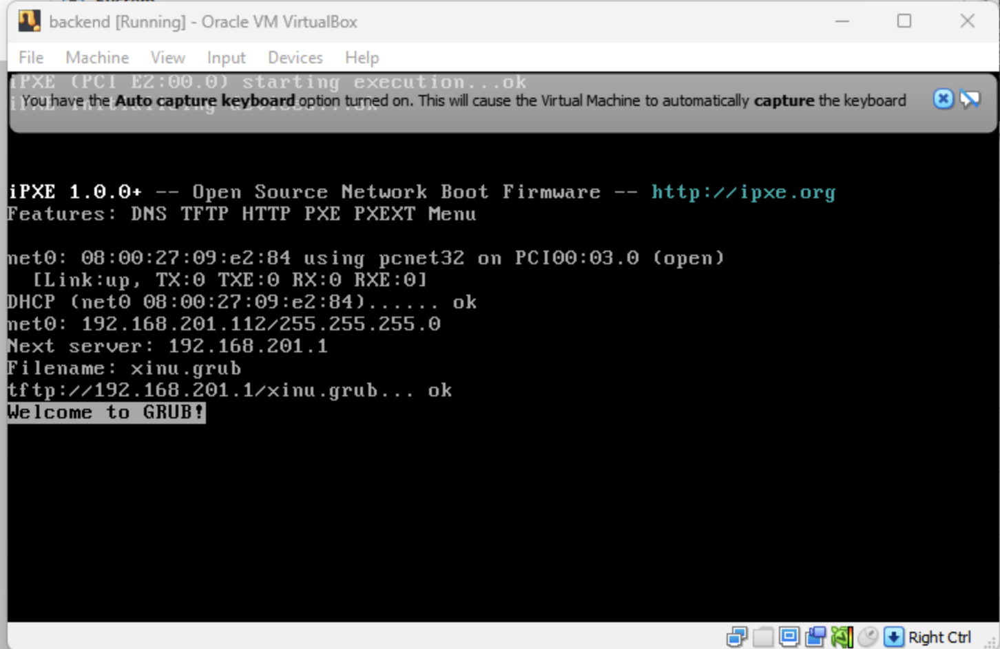

# <h1 align="center">Laporan Praktikum Modul 2 Instalasi Xinu</h1>

Benedictus Qosta Noventino Baru - 2311104029

## Dasar Teori

XINU, yang merupakan singkatan dari Xinu Is Not Unix, adalah sistem operasi berukuran kecil, sederhana, dan ringan. Sistem ini dikembangkan terutama untuk tujuan pembelajaran, penelitian, serta penggunaan pada perangkat embedded. Dalam lingkungan Ubuntu atau distribusi Linux lainnya, XINU umumnya tidak dipasang sebagai sistem operasi utama. Sebaliknya, XINU dijalankan melalui lingkungan virtualisasi seperti VirtualBox atau QEMU. Pada kondisi ini, Ubuntu berfungsi sebagai sistem host yang digunakan untuk melakukan proses pembangunan (build), kompilasi, serta pengujian terhadap kernel XINU.

## Guided

## Referensi

1. (https://telkomuniversityofficial-my.sharepoint.com/personal/maghaz_student_telkomuniversity_ac_id/_layouts/15/onedrive.aspx?id=%2Fpersonal%2Fmaghaz%5Fstudent%5Ftelkomuniversity%5Fac%5Fid%2FDocuments%2F2026%2F00%2E%20Modul%20Praktikum%20Sistem%20Operasi%20SE%202526%2D2%2Epdf&parent=%2Fpersonal%2Fmaghaz%5Fstudent%5Ftelkomuniversity%5Fac%5Fid%2FDocuments%2F2026&ga=1)
