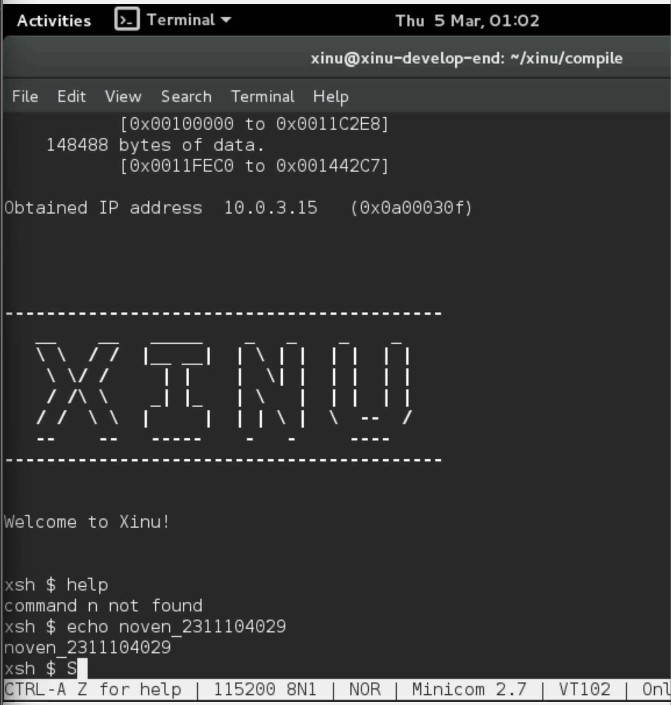

# <h1 align="center">Laporan Praktikum Modul 3 Eksplorasi Xinu</h1>

Benedictus Qosta Noventino Baru - 2311104029

## Dasar Teori

XINU, yang merupakan singkatan dari Xinu Is Not Unix, adalah sistem operasi berukuran kecil, sederhana, dan ringan. Sistem ini dikembangkan terutama untuk tujuan pembelajaran, penelitian, serta penggunaan pada perangkat embedded. Dalam lingkungan Ubuntu atau distribusi Linux lainnya, XINU umumnya tidak dipasang sebagai sistem operasi utama. Sebaliknya, XINU dijalankan melalui lingkungan virtualisasi seperti VirtualBox atau QEMU. Pada kondisi ini, Ubuntu berfungsi sebagai sistem host yang digunakan untuk melakukan proses pembangunan (build), kompilasi, serta pengujian terhadap kernel XINU.

## Guided

## Unguided

1. Berapa jumlah perintah pada Xinu? 13 perintah.

2. Sebutkan 2 perintah yang mempunyai fungsi yang sama! exit dan logout, karena keduanya sama-sama digunakan untuk keluar dari shell Xinu.

3. Berapa IP address Xinu? 192.168.1.2.

4. Perintah apa yang digunakan untuk mengetahui IP address? Perintah yang digunakan adalah ipconfig.

5. Berapa IP DNS server yang digunakan oleh Xinu? 8.8.8.8.

6. Terdapat berapa proses yang sedang berjalan pada Xinu? Biasanya terdapat sekitar 10 proses yang sedang berjalan.

7. Proses apa yang mempunyai prioritas paling rendah? Proses dengan prioritas paling rendah adalah null process.

8. Proses apa yang mempunyai ukuran paling besar? Biasanya proses dengan ukuran paling besar adalah main process.

9. Proses apa yang berada dalam state current? main process.

10. Proses apa yang berada dalam state suspend? shell process.

11. Berapa PID (Process ID) dari Main process? PID dari main process biasanya adalah 1

## Referensi

1. (https://telkomuniversityofficial-my.sharepoint.com/personal/maghaz_student_telkomuniversity_ac_id/_layouts/15/onedrive.aspx?id=%2Fpersonal%2Fmaghaz%5Fstudent%5Ftelkomuniversity%5Fac%5Fid%2FDocuments%2F2026%2F00%2E%20Modul%20Praktikum%20Sistem%20Operasi%20SE%202526%2D2%2Epdf&parent=%2Fpersonal%2Fmaghaz%5Fstudent%5Ftelkomuniversity%5Fac%5Fid%2FDocuments%2F2026&ga=1)
