# <h1 align="center">Laporan Praktikum Modul 4 EMembaca Source Code Xinu</h1>

Benedictus Qosta Noventino Baru - 2311104029

## Dasar Teori

Xinu (Xinu Is Not Unix) merupakan sistem operasi yang dikembangkan khusus untuk kebutuhan embedded system. Proses pembuatannya menggunakan pendekatan cross-development, di mana penulisan dan kompilasi program dilakukan pada komputer host seperti PC atau laptop berbasis Linux atau Windows. Setelah itu, hasil kompilasinya berupa file image dijalankan pada perangkat target. Bahasa C menjadi bahasa utama dalam pengembangan Xinu karena kemampuannya mengakses perangkat keras secara langsung, sesuatu yang sangat dibutuhkan dalam sistem operasi yang menuntut kontrol penuh terhadap sumber daya hardware. Struktur kode sumber Xinu pun disusun secara modular dalam berbagai direktori yang memiliki fungsi masing-masing, mulai dari proses kompilasi dan konfigurasi sistem hingga implementasi kernel, pustaka, jaringan, dan antarmuka perintah. Berbagai komponen penting seperti proses, semaphore, manajemen memori, serta komunikasi antarpocess direpresentasikan melalui header khusus, misalnya process.h atau semaphore.h. Selain itu, mekanisme inti seperti scheduler (resched.c) dan context switching (ctxsw.S) memegang peran kunci dalam pengaturan eksekusi proses. Interaksi antara program pengguna dan kernel dilakukan melalui system call yang biasanya ditulis dalam file terpisah di direktori sistem. Untuk menjaga portabilitas, Xinu juga menerapkan aturan tertentu dalam penamaan dan penggunaan tipe data sehingga ukuran dan perilakunya tetap konsisten di berbagai arsitektur perangkat keras.

## Guided

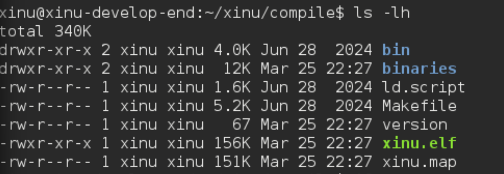

1. Setelah proses kompilasi Xinu berhasil dijalankan, sistem akan menghasilkan sebuah image bernama xinu.boot. Ukuran file ini umumnya berkisar antara puluhan hingga ratusan kilobyte, tergantung konfigurasi dan modul yang disertakan selama kompilasi. File image xinu.boot tersebut dapat ditemukan di dalam folder compile/ pada direktori proyek Xinu.

2. Sourcetrail
   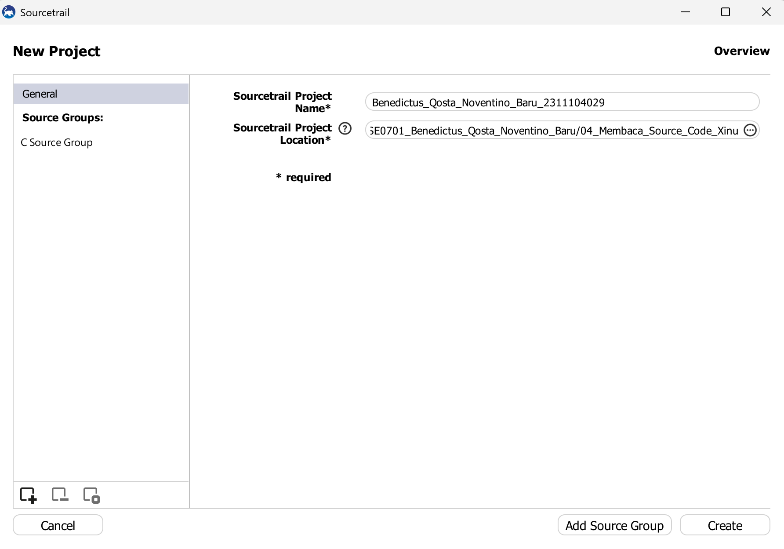
   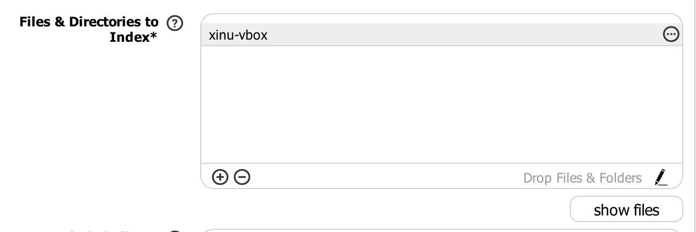
   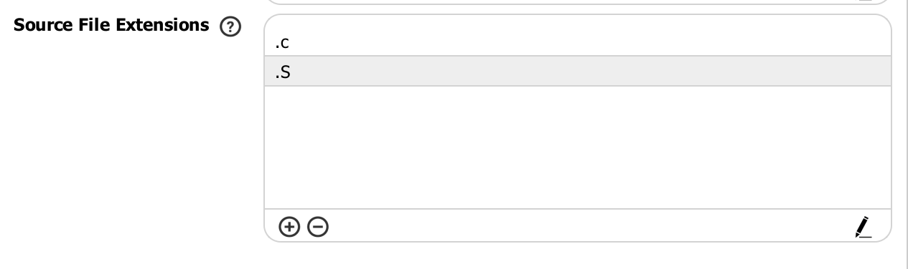
   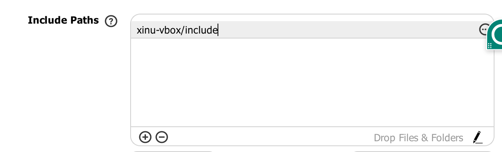
   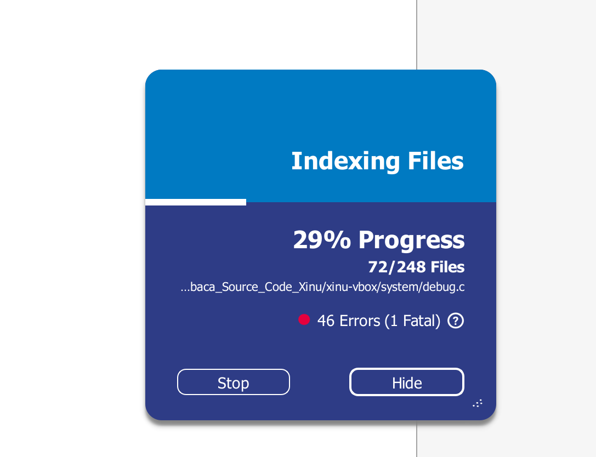
   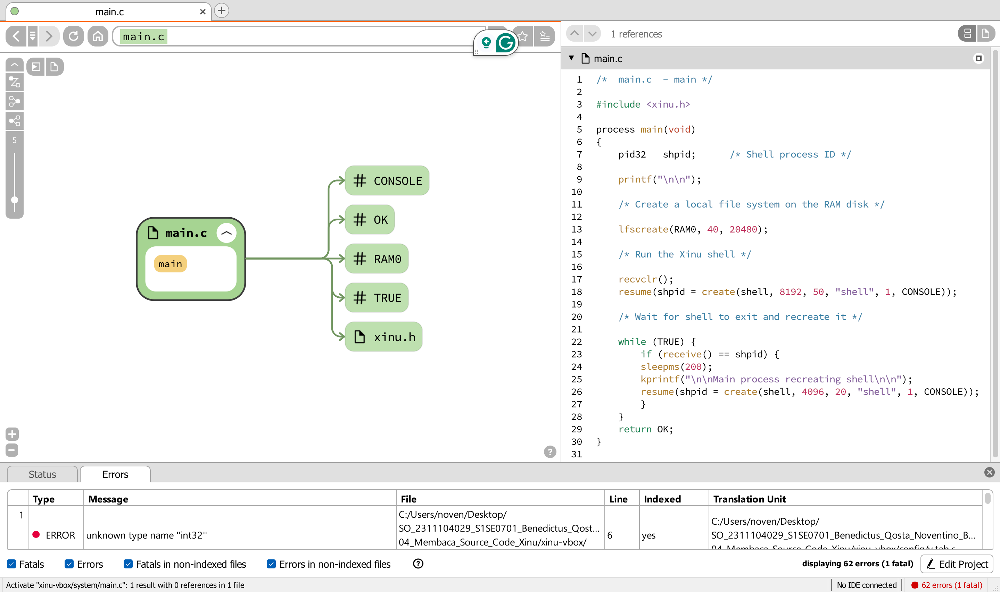

3. 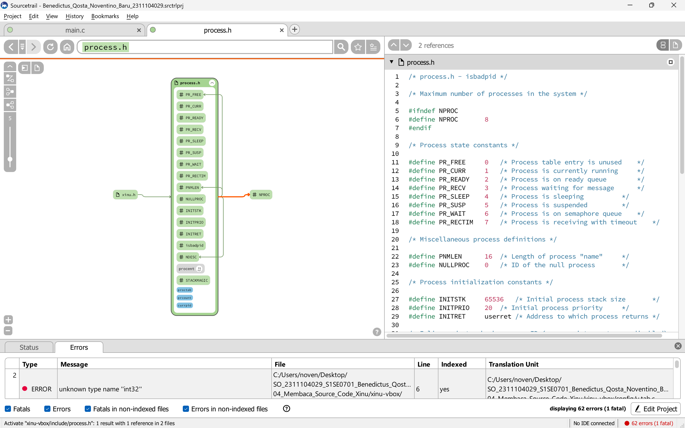
   Struktur data proses pada Xinu OS disimpan dalam file proc.h yang berada di dalam folder include. Di dalam file tersebut terdapat struktur struct procent yang menyimpan berbagai informasi penting mengenai proses, seperti ID proses, status proses, prioritas, ukuran stack, alamat awal stack, pointer ke stack saat ini, waktu CPU, nama proses, serta berbagai variabel kontrol yang diperlukan kernel untuk melakukan manajemen proses. Struktur ini merupakan representasi lengkap dari seluruh informasi yang dibutuhkan sistem Xinu untuk mengatur siklus hidup sebuah proses.

4. Mengubah welcome banner pada Xinu
   a. ada di shell.h
   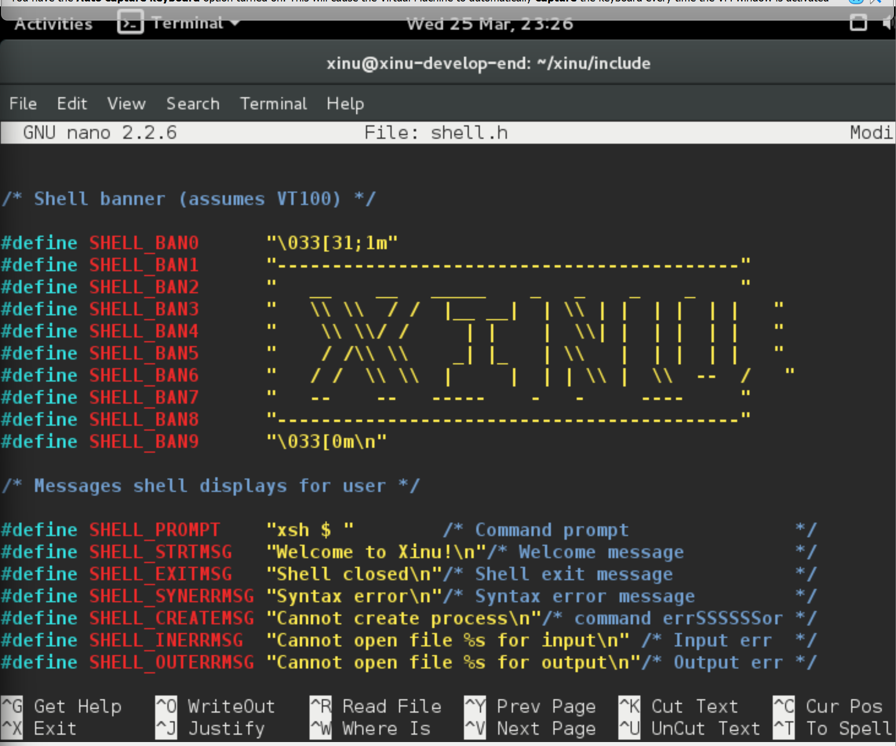

b. File yang menampilkan banner Xinu berada pada xinu/shell/shell.c, yaitu file yang memanggil SHELL_STRTMSG menggunakan fungsi printf() ketika shell dimulai.
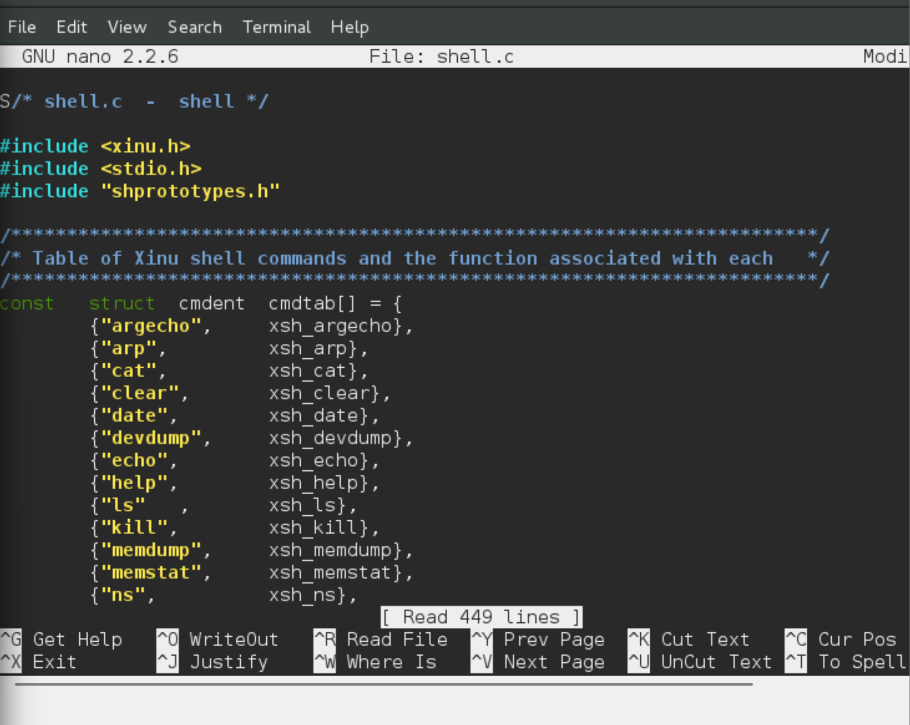

c. 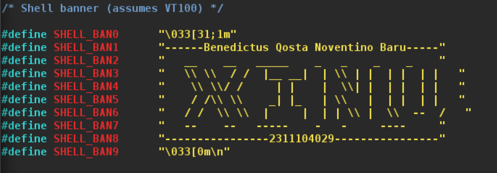

## Referensi

1. (https://telkomuniversityofficial-my.sharepoint.com/personal/maghaz_student_telkomuniversity_ac_id/_layouts/15/onedrive.aspx?id=%2Fpersonal%2Fmaghaz%5Fstudent%5Ftelkomuniversity%5Fac%5Fid%2FDocuments%2F2026%2F00%2E%20Modul%20Praktikum%20Sistem%20Operasi%20SE%202526%2D2%2Epdf&parent=%2Fpersonal%2Fmaghaz%5Fstudent%5Ftelkomuniversity%5Fac%5Fid%2FDocuments%2F2026&ga=1)
