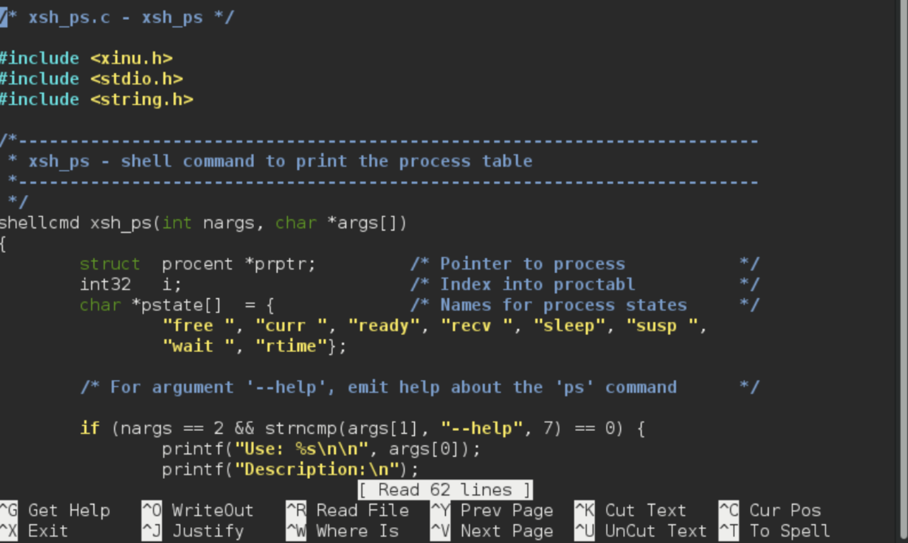
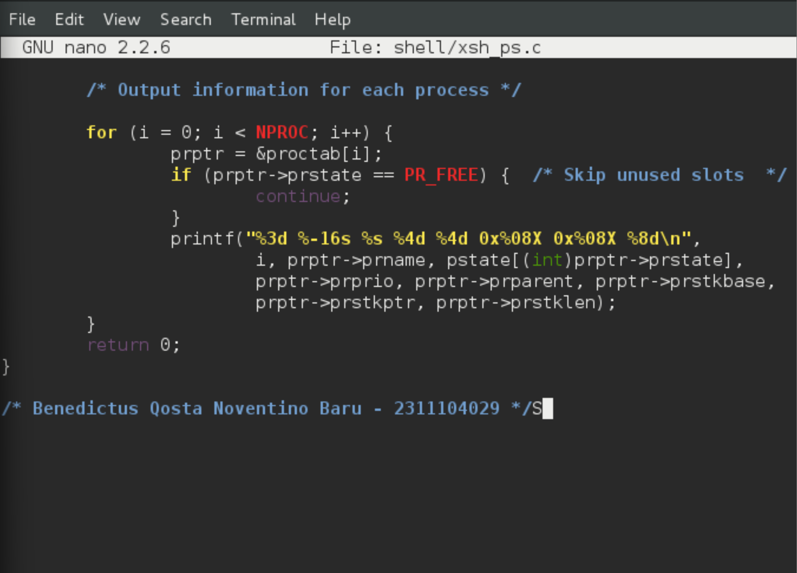
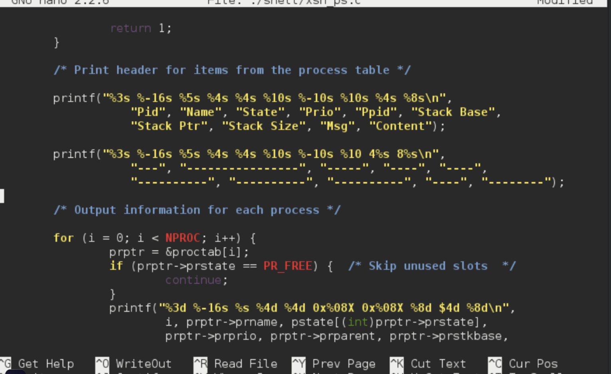
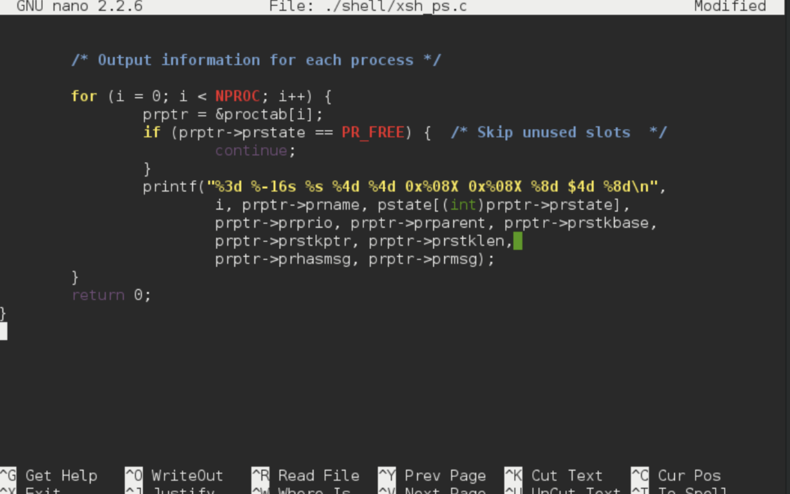
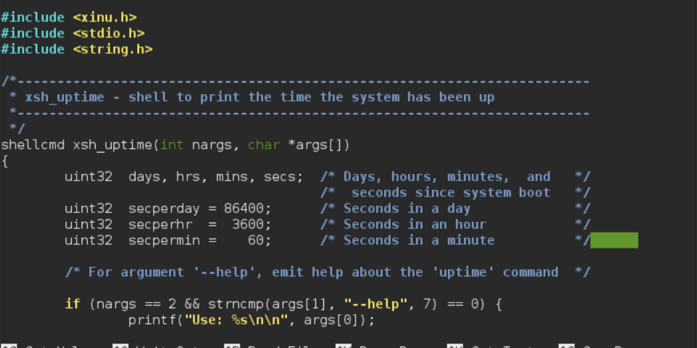
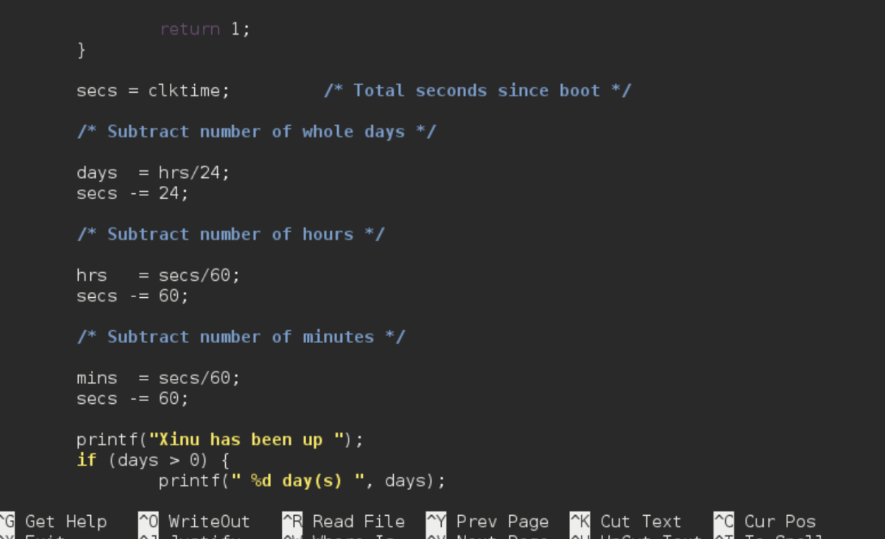

# <h1 align="center">Laporan Praktikum Modul 5 Eksplorasi Proses Xinu</h1>

Benedictus Qosta Noventino Baru - 2311104029

## Dasar Teori

Xinu (Xinu Is Not Unix) merupakan sistem operasi yang dirancang untuk tujuan pembelajaran dengan struktur proses yang sederhana dan ringan. Setiap proses di dalam Xinu direpresentasikan melalui struktur data yang disebut Process Control Block (PCB), yang berisi informasi penting seperti status proses (state), tingkat prioritas, alamat stack, serta mekanisme komunikasi antar proses melalui message passing. Dalam pengelolaan proses, Xinu mengenal beberapa status utama, antara lain PR_CURR (proses yang sedang dieksekusi), PR_READY (proses siap dijalankan), PR_RECV (proses yang sedang menunggu pesan), dan PR_WAIT (proses yang menunggu semaphore). Perubahan pada perintah sistem seperti ps dan uptime dilakukan dengan memodifikasi kode sumber yang terdapat pada direktori shell, kemudian dilakukan proses kompilasi ulang menggunakan cross-compiler.

## Guided

### Berdasarkan dokumentasi Xinu:

Jumlah maksimum proses ditentukan oleh konstanta NPROC, yang secara default bernilai 50 proses. Panjang maksimum nama proses diatur oleh PNMLEN, yaitu 16 karakter (termasuk null terminator). Untuk prioritas awal, proses pengguna umumnya dimulai dengan nilai prioritas 20.

Selain itu, Xinu memiliki total 9 state proses, yaitu: FREE, CURR, READY, RECV, SLEEP, SUSP, WAIT, RECTIME, dan SND.

### Memberi Komentar xsf_ps.c

### Ubah perintah ps (source code: xsh_ps.c) pada Xinu

### Modify the uptime command on Xinu

## Referensi

1. (https://telkomuniversityofficial-my.sharepoint.com/personal/maghaz_student_telkomuniversity_ac_id/_layouts/15/onedrive.aspx?id=%2Fpersonal%2Fmaghaz%5Fstudent%5Ftelkomuniversity%5Fac%5Fid%2FDocuments%2F2026%2F00%2E%20Modul%20Praktikum%20Sistem%20Operasi%20SE%202526%2D2%2Epdf&parent=%2Fpersonal%2Fmaghaz%5Fstudent%5Ftelkomuniversity%5Fac%5Fid%2FDocuments%2F2026&ga=1)
