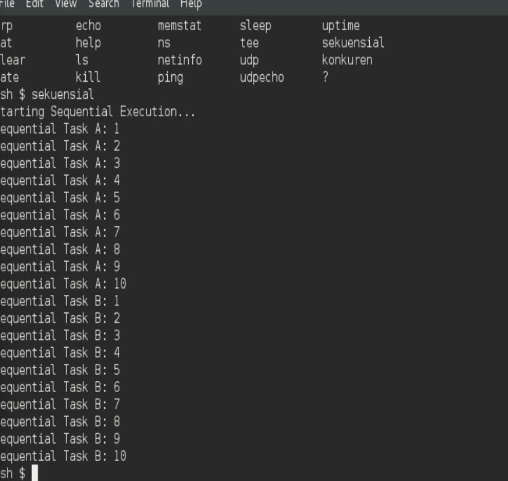
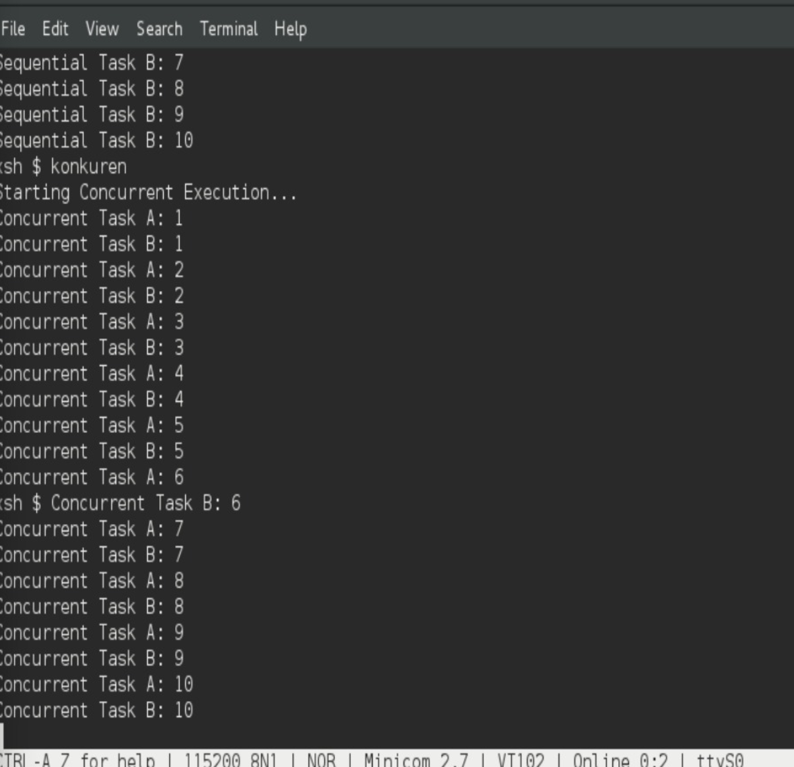
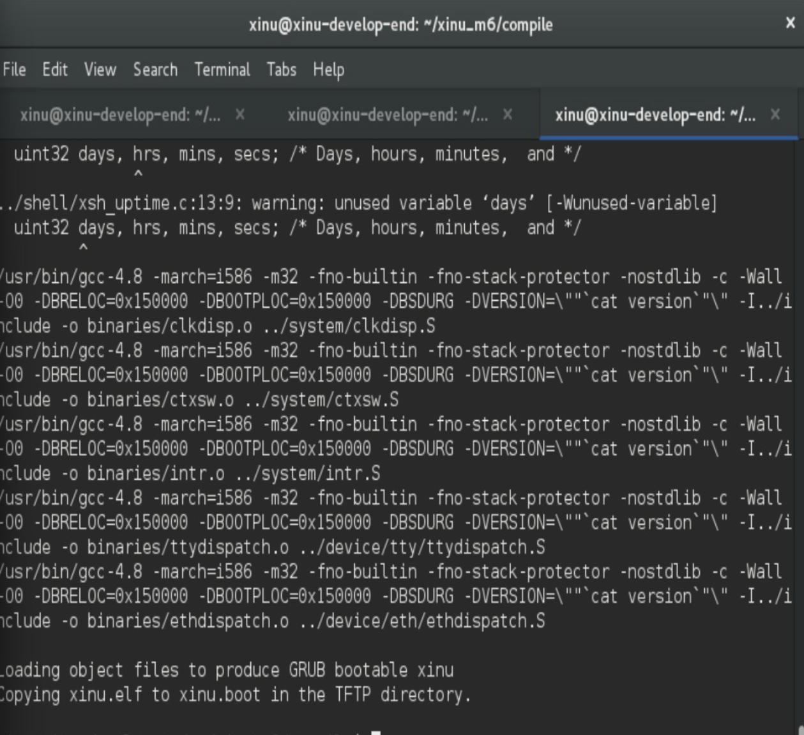
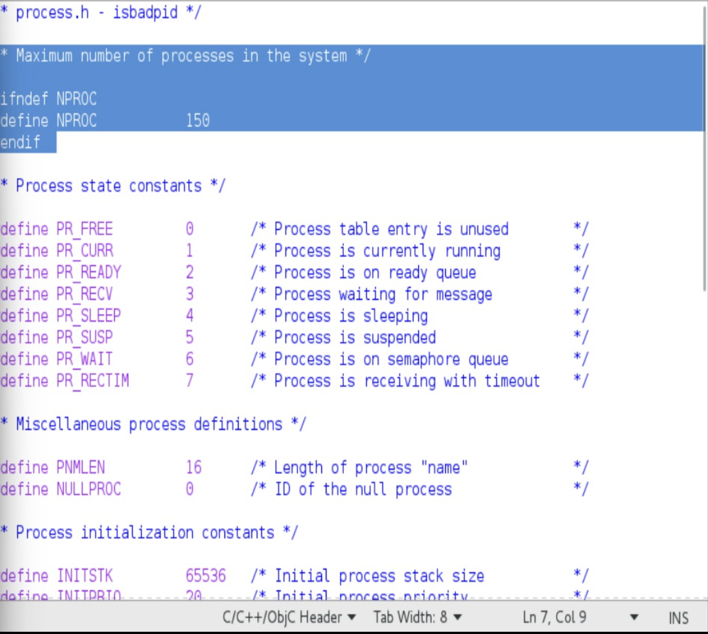
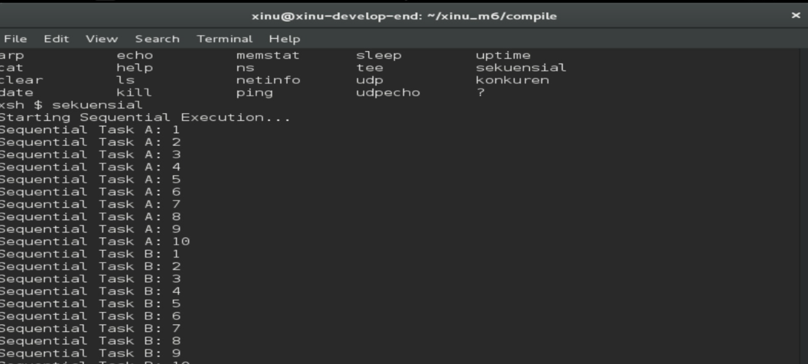
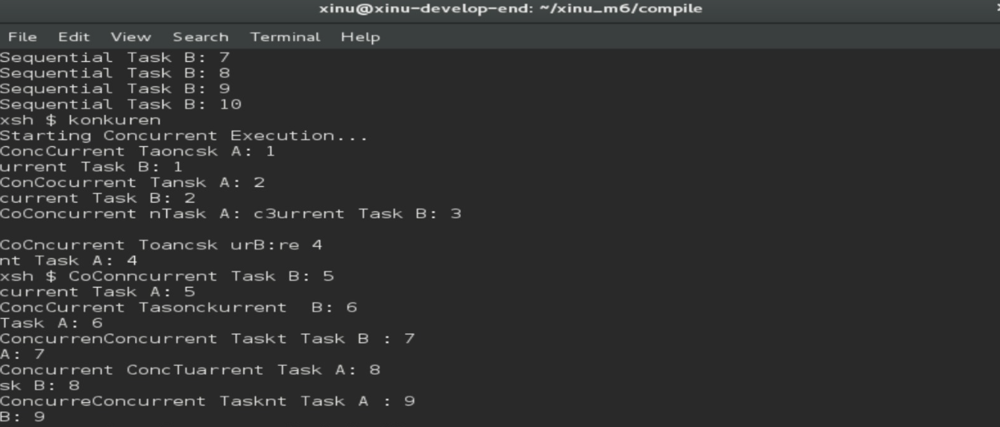
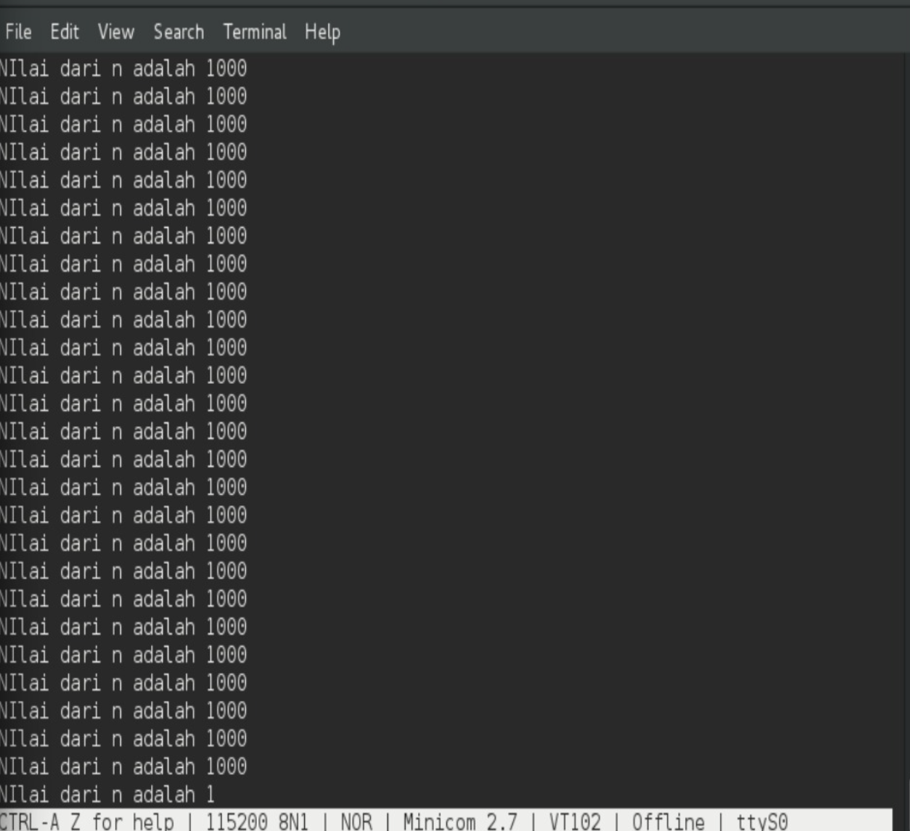
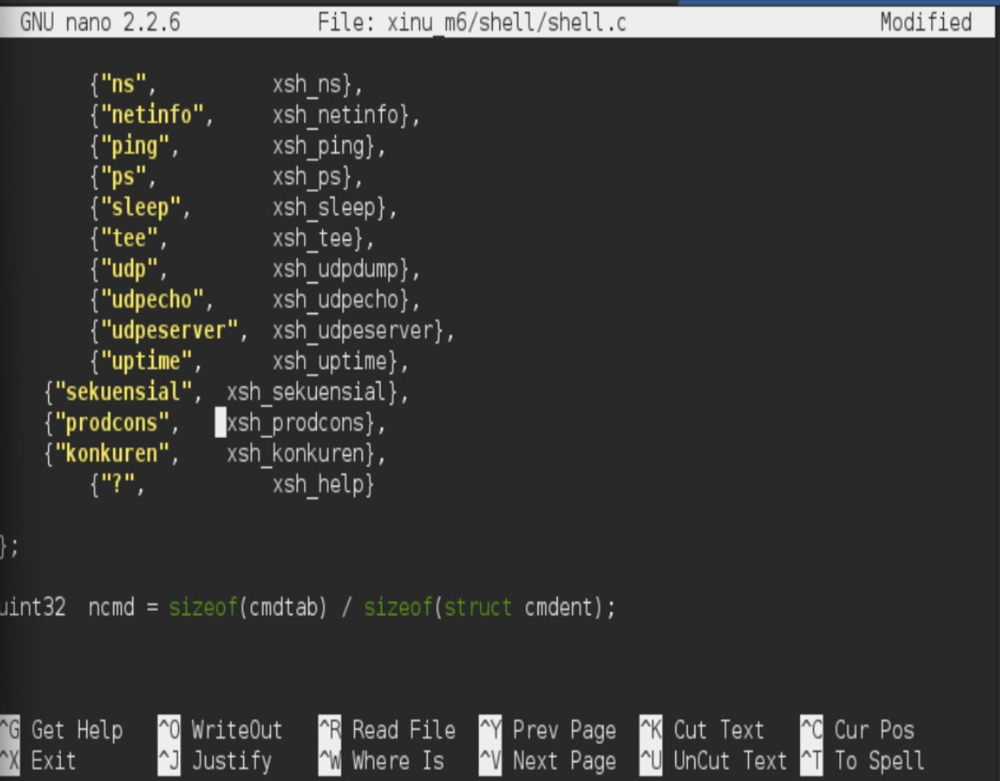
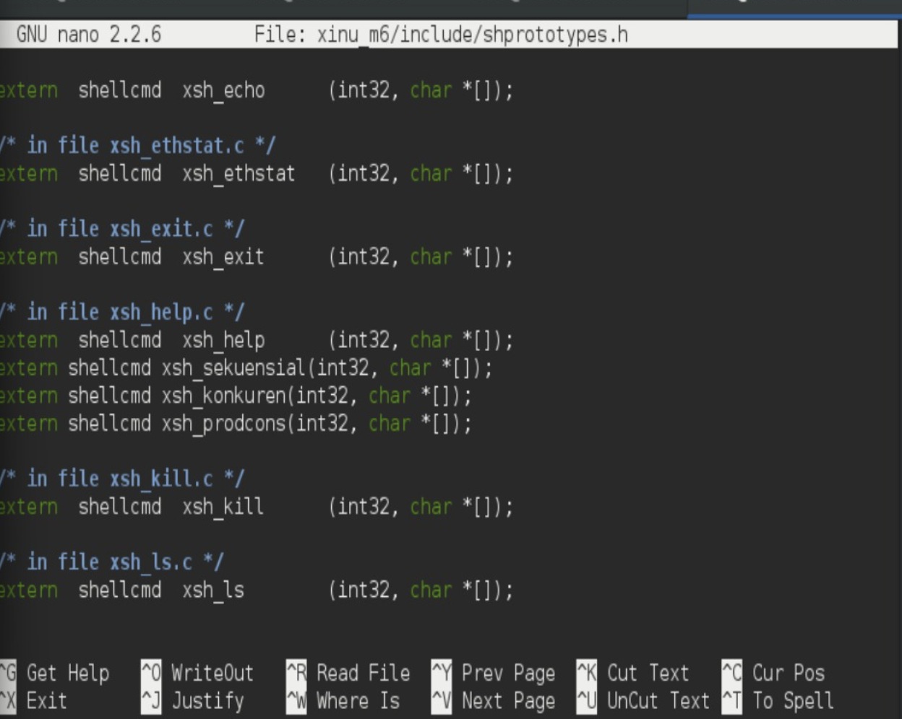

# <h1 align="center">Laporan Praktikum Modul 6 Sekuensial dan Konkuren</h1>

Benedictus Qosta Noventino Baru - 2311104029

## Dasar Teori

Eksekusi sekuensial adalah metode menjalankan instruksi atau proses satu per satu, di mana sebuah proses baru dapat dijalankan setelah proses sebelumnya selesai. Dalam model ini hanya terdapat satu jalur eksekusi yang aktif pada suatu waktu. Pendekatan ini mudah dipahami karena tidak melibatkan proses yang berjalan bersamaan, tetapi memiliki kelemahan dalam hal efisiensi, terutama pada sistem yang mendukung multitasking. Berbeda dengan itu, eksekusi konkuren memungkinkan beberapa proses aktif dalam periode waktu yang sama. Pada sistem dengan satu prosesor, hal ini terjadi melalui mekanisme context switching, yaitu pergantian eksekusi antar proses dengan sangat cepat sehingga tampak seperti berjalan bersamaan. Pada sistem multiprosesor, beberapa proses dapat dijalankan secara paralel secara nyata. Pendekatan konkuren meningkatkan pemanfaatan CPU dan membuat sistem lebih responsif, tetapi juga membawa tantangan seperti kebutuhan akan sinkronisasi, risiko race condition, serta kemungkinan terjadinya deadlock.

## Guided

## Unguided

1. Selain hardware (memory), batasan maksimal proses dapat ditentukan dengan secara software. Pada Linux maksimal proses adalah 4194303 proses (64 bit) dan 32767 proses (32 bit) dapat dilihat melalui perintah $cat /proc/sys/kernel/pid_max

Carilah pada source code Xinu yang memberi batasan mengenai banyaknya proses yang bisa dibuat! Berapa maksimal proses dalam Xinu? Ubah menjadi maksimal 150 proses!

maksimal proses pada Xinu ditentukan secara software melalui konstanta NPROC pada file process.h. Nilai awal maksimal proses pada Xinu adalah 8 proses. Pada praktikum ini nilai tersebut diubah menjadi 150 proses dengan memodifikasi konstanta NPROC.

Langkah pengerjaan :

Jalankan development-sysyem
Ketik "cd xinu/compile/include"
Lalu ketik "gedit process.h"
Cari konstanta jumlah maksimal proses: #define NPROC , lalu ubah menjadi 150
Klik save
Lakukan kompilasi ulang seperti no 2 , lalu make clean dan make

2. Jalankan kode sekuensial!

Kode sekuensial dijalankan dengan perintah sekuensial pada shell Xinu. Pada proses sekuensial, setiap proses dieksekusi secara berurutan, dimana proses berikutnya akan berjalan setelah proses sebelumnya selesai dieksekusi. Hal ini menyebabkan output tampil secara terurut tanpa adanya interleaving antar proses.

Langkah pengerjaan :

Jalankan minicom dengan ketik "sudo minicom"
Masukkan password "xinurocks"
jalankan perintah "sekuensial"

3. Jalankan kode konkuren!

Kode konkuren dijalankan dengan perintah konkuren pada shell Xinu. Pada proses konkuren, beberapa proses berjalan secara bersamaan atau bergantian berdasarkan scheduler CPU. Akibatnya output dari tiap proses dapat tampil secara tidak berurutan karena proses dieksekusi secara overlap/interleaving.

Langkah pengerjaan :

Pada shell Xinu jalankan perintah: konkuren

4. Buatlah 2 proses produser dan konsumer. Produser memproduksi angka integer dari 1-1000. Konsumer mengkonsumsi integer yang diproduksi oleh produser dan menampilkannya! (Gunakan variabel global bertipe int32 bernama n yang digunakan secara bersama oleh kedua proses)

Program ini memperlihatkan nilai variabel global n yang dibaca oleh proses konsumer ketika proses produser terus melakukan increment. Output yang muncul tidak selalu berurutan karena kedua proses berjalan secara konkuren dan dieksekusi bergantian oleh scheduler CPU. Tanpa mekanisme sinkronisasi, kedua proses tersebut mengakses variabel yang sama secara bersamaan sehingga terjadi race condition. Akibatnya, nilai yang dibaca konsumer bisa tidak urut, muncul berulang, atau tidak meningkat sesuai harapan. Untuk mengimplementasikan program ini, pertama masuk ke folder proyek Xinu modul 6 dengan perintah cd xinu_m6. Karena format perintah sekuensial sudah tersedia, file tersebut dapat disalin sebagai dasar menggunakan cp shell/xsh_sekuensial.c shell/xsh_prodcons.c. Selanjutnya buka file baru tersebut menggunakan gedit shell/xsh_prodcons.c dan ganti isinya dengan kode yang mendefinisikan variabel global n, proses produser yang menambah nilai n, proses konsumer yang mencetak nilai n, serta fungsi shell yang membuat dan menjalankan kedua proses tersebut menggunakan create() dan resume(). Setelah file disimpan, buka daftar perintah shell melalui nano shell/shell.c, gunakan Ctrl+W untuk mencari entri sekuensial, lalu tambahkan baris {"prodcons", xsh_prodcons}, sebagai perintah baru. Dengan langkah ini, perintah prodcons dapat dijalankan dari shell Xinu untuk mengamati perilaku konkuren dan efek race condition yang muncul.

Ctrl + o untuk save lalu enter. Buka Prototype pakai Nano : nano xinu_m6/include/shprototypes.h. Tekan Ctrl + W lalu ketik xsh_sekuensial dan enter. Tambahkan dibawahnya : extern shellcmd xsh_prodcons(int32, char \*[]);

Tekan Ctrl + o untuk save lalu enter. Ctrl X. Compile program dengan cd xinu_m6/compile sampai sudo minicom. ketik prodcons

## Referensi

1. (https://telkomuniversityofficial-my.sharepoint.com/personal/maghaz_student_telkomuniversity_ac_id/_layouts/15/onedrive.aspx?id=%2Fpersonal%2Fmaghaz%5Fstudent%5Ftelkomuniversity%5Fac%5Fid%2FDocuments%2F2026%2F00%2E%20Modul%20Praktikum%20Sistem%20Operasi%20SE%202526%2D2%2Epdf&parent=%2Fpersonal%2Fmaghaz%5Fstudent%5Ftelkomuniversity%5Fac%5Fid%2FDocuments%2F2026&ga=1)
