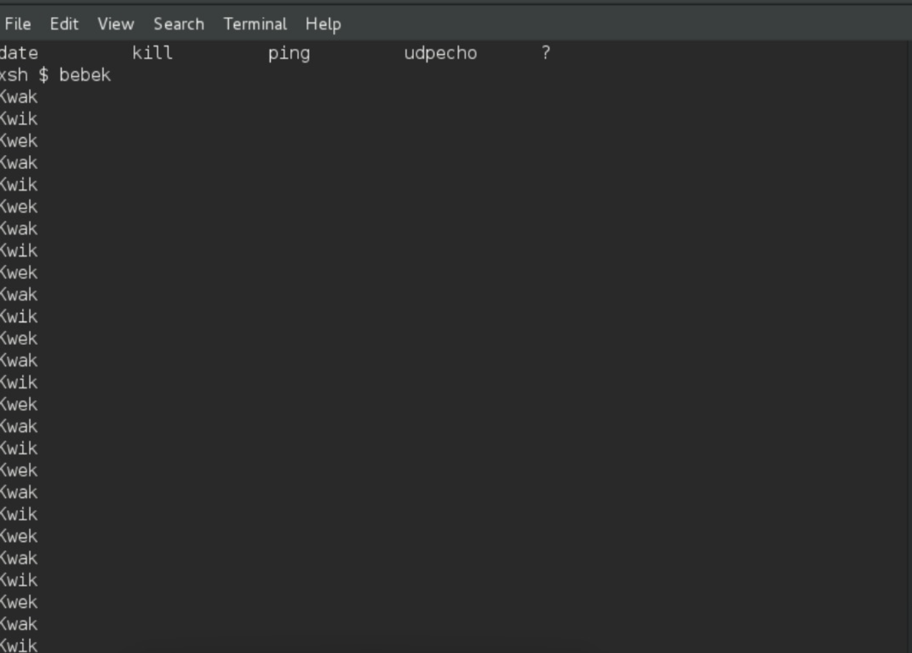
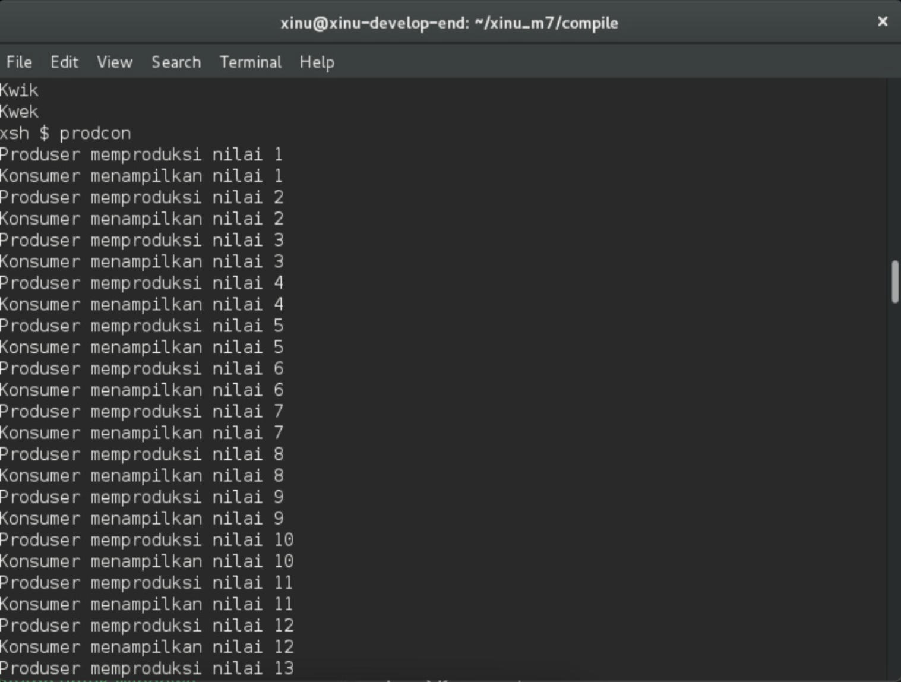

# <h1 align="center">Laporan Praktikum Modul 7 Semaphore</h1>

Benedictus Qosta Noventino Baru - 2311104029

## Dasar Teori

Semaphore adalah mekanisme sinkronisasi dalam sistem operasi yang berfungsi untuk mengatur akses proses-proses yang berjalan secara konkuren terhadap sumber daya bersama serta mengendalikan urutan eksekusinya. Pada Xinu, semaphore dikelola melalui tiga operasi utama, yaitu semcreate() untuk menginisialisasi nilai awal, wait() untuk menurunkan nilai semaphore yang dapat menyebabkan proses masuk ke kondisi blocked ketika nilainya tidak mencukupi, serta signal() untuk menaikkan kembali nilai semaphore. Dalam penerapannya, semaphore umumnya digunakan dalam dua pola, yaitu pola signaling yang mengatur urutan eksekusi antar proses agar berjalan sesuai alur yang diinginkan, dan pola mutex (Mutual Exclusion) yang memastikan hanya satu proses yang dapat mengakses critical section atau variabel bersama pada satu waktu, sehingga dapat menghindari terjadinya race condition.

## Guided

Langkah pertama adalah menjalankan development system melalui VirtualBox, kemudian membuka terminal dan mengetik perintah ls untuk melihat isi direktori. Selanjutnya, unduh file modul dengan perintah wget agha.work/modul7.sh, lalu gunakan kembali perintah ls untuk memastikan file modul 7 sudah berhasil terunduh. Setelah itu, ubah izin file agar dapat dieksekusi dengan perintah chmod +x modul7.sh, dan cek kembali menggunakan ls. Untuk melihat isi file, gunakan perintah cat modul7.sh, kemudian jalankan file tersebut dengan mengetik ./modul7.sh untuk masuk ke folder modul. Setelah itu, cek kembali isi direktori dengan ls, lalu masuk ke folder proyek Xinu modul 7 menggunakan perintah cd xinu_m7/compile/. Tahap berikutnya adalah melakukan proses kompilasi dengan menjalankan make clean kemudian make. Jika terjadi kegagalan, jalankan kembali make hingga proses kompilasi berhasil tanpa error. Terakhir, jalankan backend dengan perintah sudo minicom untuk menjalankan sistem Xinu.

## Unguided

1. Buatlah 3 buah proses yaitu P1, P2 dan P3. P1 selalu menampilkan “kwak”, P2 selalu menampilkan “kwik”, P3 selalu menampilkan “kwek”. Menggunakan 3 proses tersebut dan beberapa buah semaphore, buatlah program yang dapat menampilkan:

2. Buatlah proses bernama produser yang memproduksi bilangan 1-1000. Buatlah proses bernama konsumer yang akan menampilkan nilai yang diproduksi oleh produser. Gunakan semaphore!

## Referensi

1. (https://telkomuniversityofficial-my.sharepoint.com/personal/maghaz_student_telkomuniversity_ac_id/_layouts/15/onedrive.aspx?id=%2Fpersonal%2Fmaghaz%5Fstudent%5Ftelkomuniversity%5Fac%5Fid%2FDocuments%2F2026%2F00%2E%20Modul%20Praktikum%20Sistem%20Operasi%20SE%202526%2D2%2Epdf&parent=%2Fpersonal%2Fmaghaz%5Fstudent%5Ftelkomuniversity%5Fac%5Fid%2FDocuments%2F2026&ga=1)
