# <h1 align="center">Laporan Praktikum Modul 9 Syscall Xinu</h1>

Benedictus Qosta Noventino Baru - 2311104029

## Dasar Teori

System call (syscall) adalah mekanisme yang memungkinkan program di user mode meminta layanan tertentu dari kernel sistem operasi. Pada sistem operasi modern, terdapat pemisahan antara mode pengguna dan mode kernel untuk menjaga keamanan serta mencegah aplikasi mengakses perangkat keras atau sumber daya penting secara langsung. Karena itu, system call berfungsi sebagai perantara yang memungkinkan program user berkomunikasi dengan kernel. Ketika sebuah syscall dipanggil, eksekusi program dialihkan dari user mode ke kernel mode melalui trap atau interrupt khusus. Kernel kemudian memeriksa permintaan tersebut, menjalankan fungsi yang diperlukan, dan mengembalikan kendali beserta hasil eksekusi kembali ke program user. Dengan cara ini, seluruh akses terhadap sumber daya kritis seperti CPU, memori, dan perangkat I/O tetap berada di bawah kontrol sistem operasi.

## Guided

1. ls
2. wget agha.work/modul9.sh
3. cat modul9.sh
4. chmod +x modul9.sh
5. ls
6. ./modul9.sh
7. ls
8. cd xinu_m9/compile/
9. make clean
10. make
11. sudo minicom
12. history

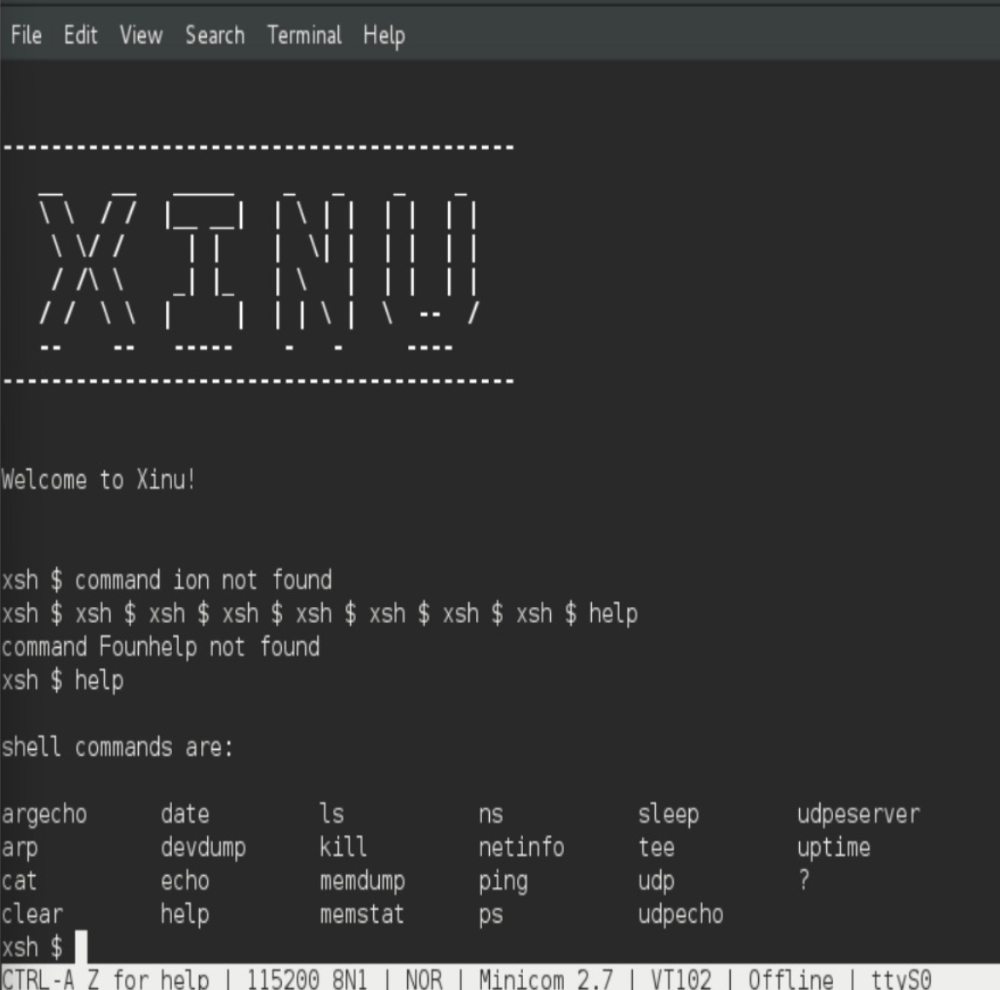

## Unguided

1. Buat syscall baru seperti yang ditunjukkan pada modul syscall poin 9.5! (sertakan Screenshot kode dan hasil run)

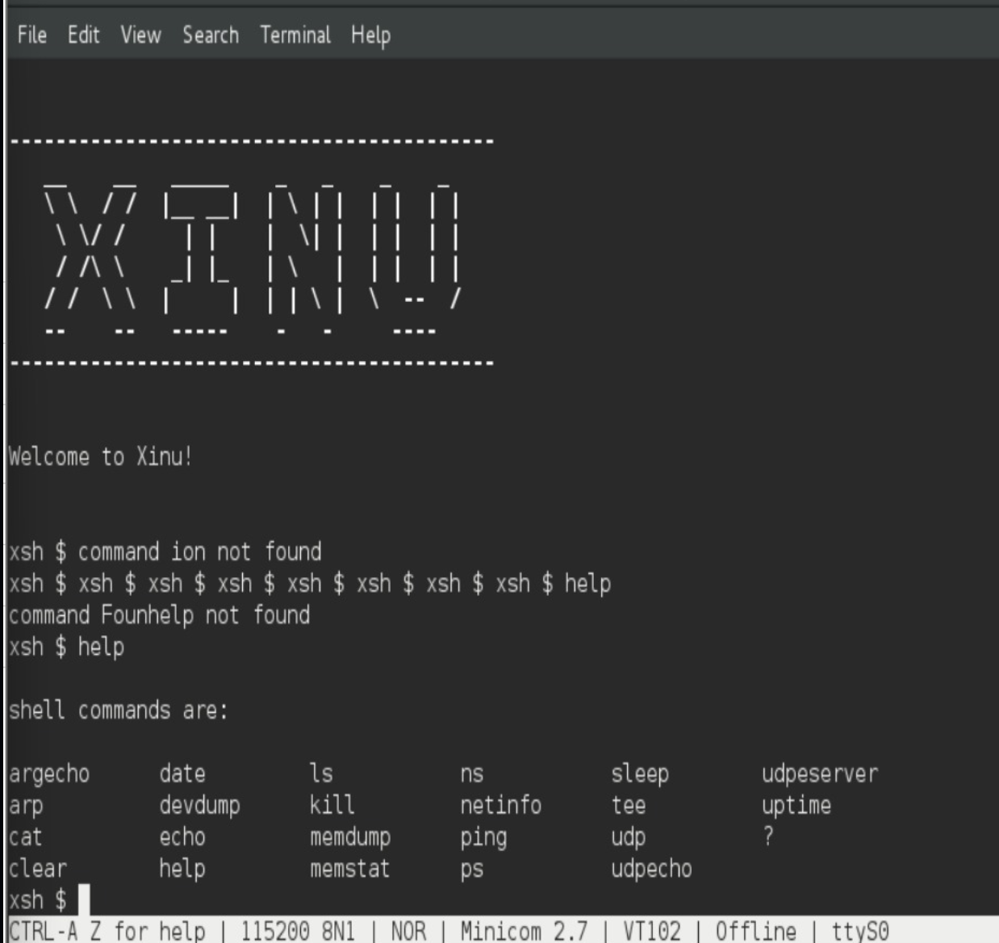

2. Perbaiki syscall chprio (xinu/system/chprio.c) dengan memperhatikan validasi input

a. Pastikan id adalah angka dari 0 – NPROC (ukuran maks banyaknya proses)
b. Pastikan prioritas adalah bilangan yang positif

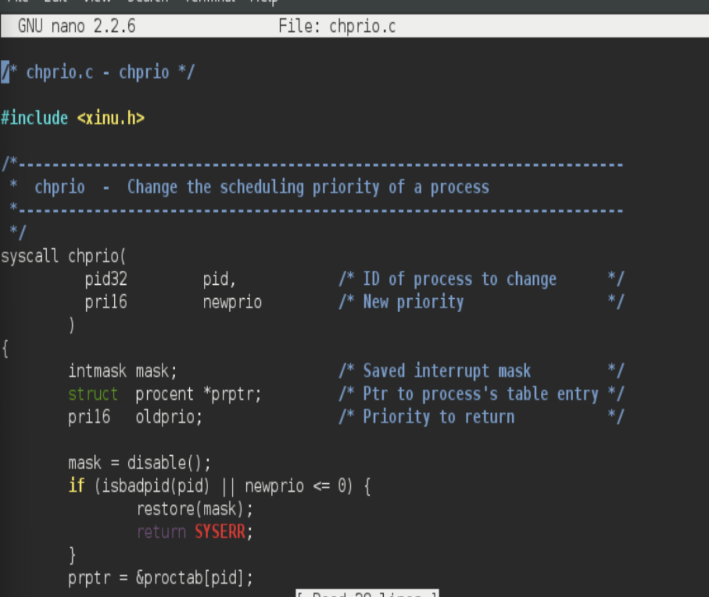

jalankan Xinu dengan syscall yang telah diperbaiki make clean dan make

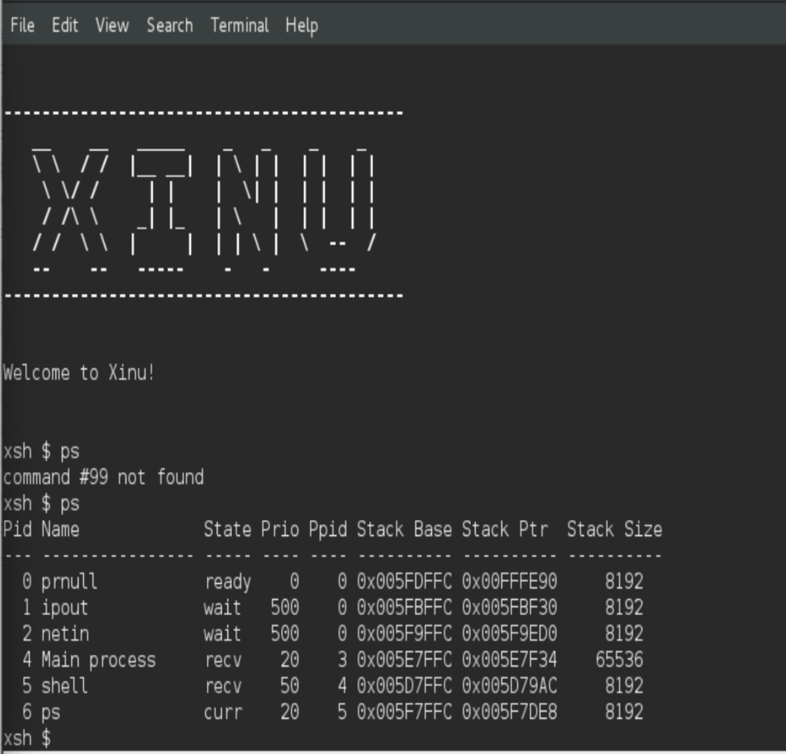

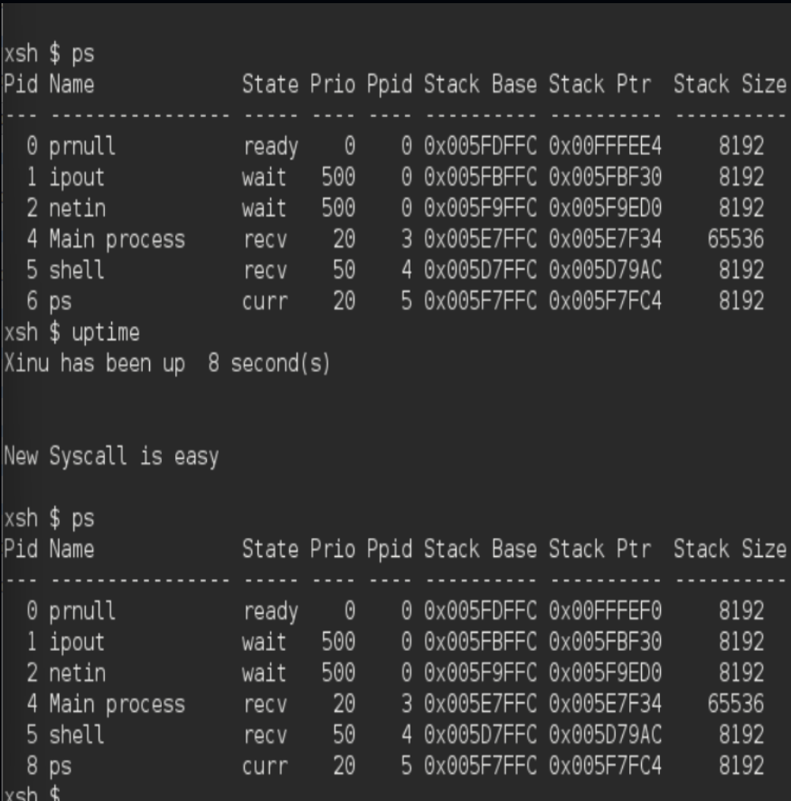

3. Lakukan hal-hal berikut ini

Edit xsh_uptime.c
Tambahkan kode berikut

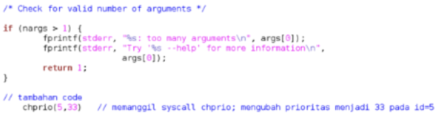

Compile source code tersebut dengan perintah make clean make
Jalankan perintah ps xsh $ ps
perhatikan prioritas proses dengan id = 5
Jalankan uptime xsh $ uptime
Perhatikan hasil perintah tersebut
Jalankan ps xsh $ ps perhatikan prioritas proses dengan id = 5 seharusnya sudah berubah

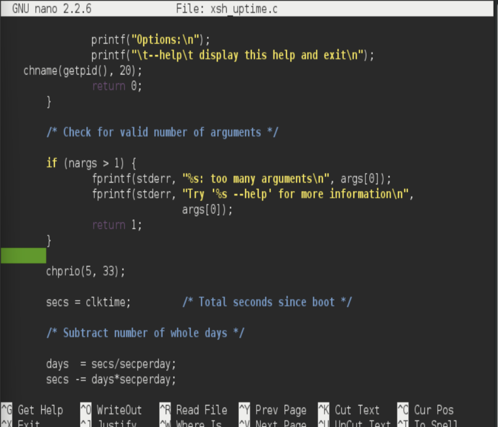

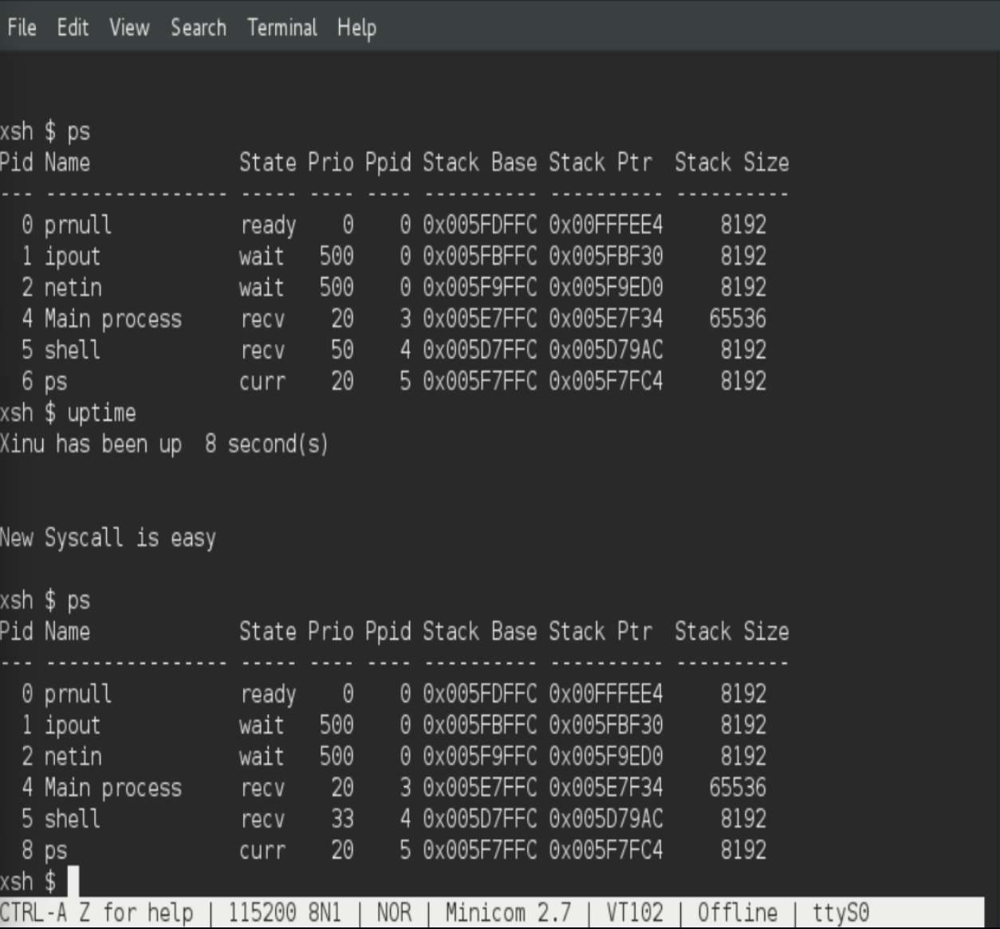

4.  Testing chprio syscall yang telah diubah

Testing prioritas tidak boleh < 0: Ubah “chprio(5,33)” menjadi “chprio(5,-3)” pada xsh_uptime.c

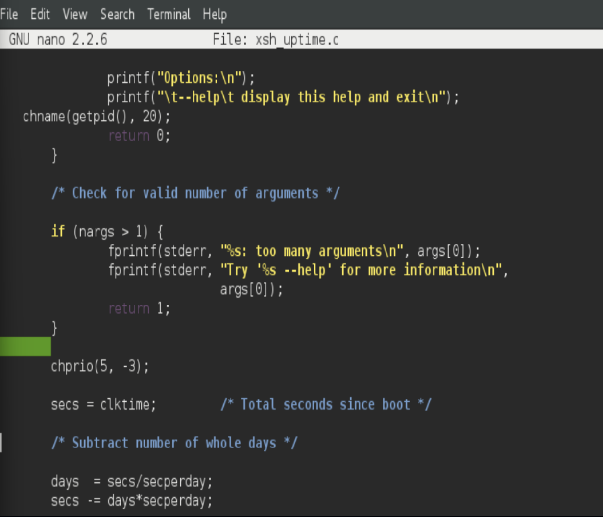

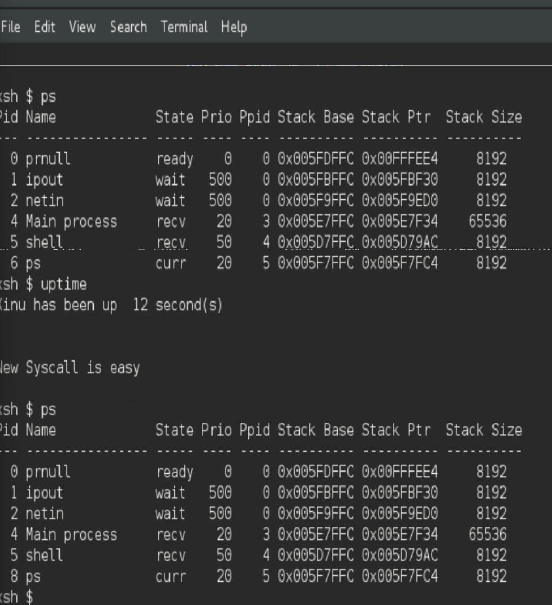

Testing id adalah valid: Ubah “chprio(5,33)” menjadi “chprio(3000,3)”

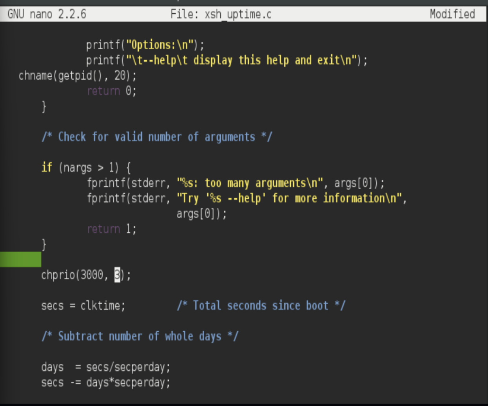

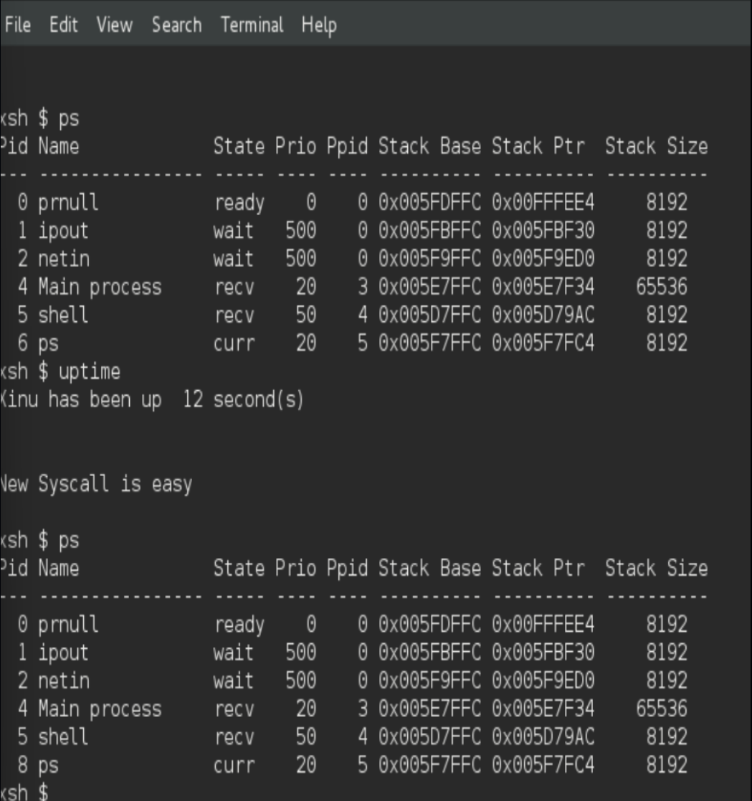

Hasil dua testing di atas adalah prioritas tidak berubah karena salah argument (dibuktikan dengan menggunakan perintah ps)

## Referensi

1. (https://telkomuniversityofficial-my.sharepoint.com/personal/maghaz_student_telkomuniversity_ac_id/_layouts/15/onedrive.aspx?id=%2Fpersonal%2Fmaghaz%5Fstudent%5Ftelkomuniversity%5Fac%5Fid%2FDocuments%2F2026%2F00%2E%20Modul%20Praktikum%20Sistem%20Operasi%20SE%202526%2D2%2Epdf&parent=%2Fpersonal%2Fmaghaz%5Fstudent%5Ftelkomuniversity%5Fac%5Fid%2FDocuments%2F2026&ga=1)
