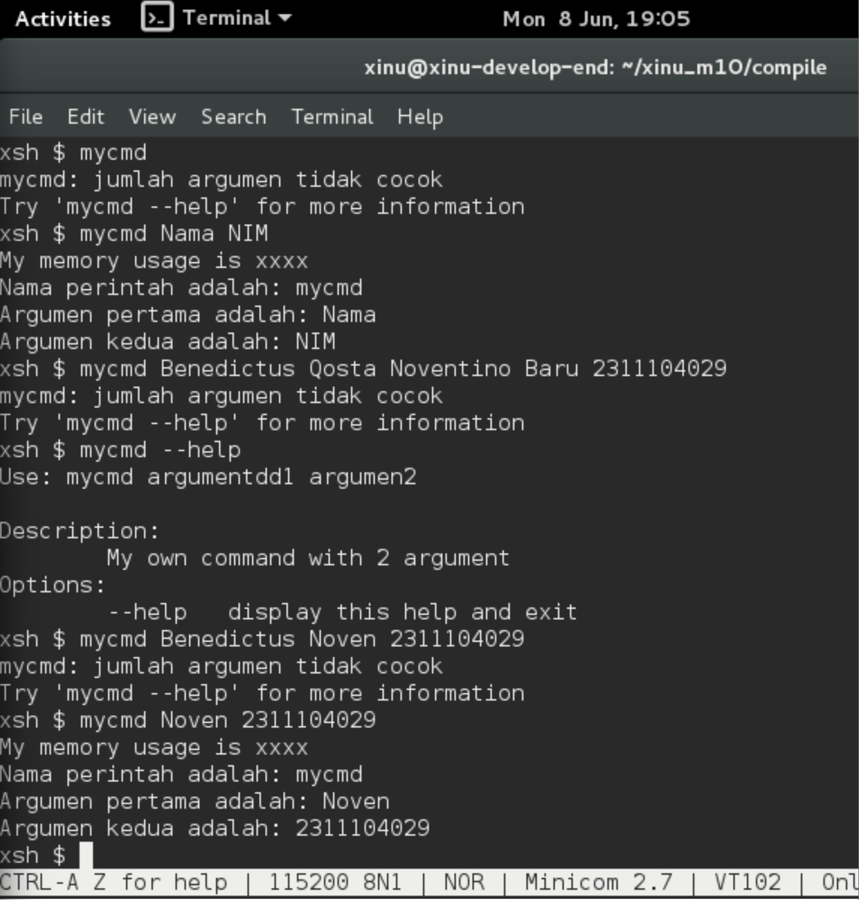
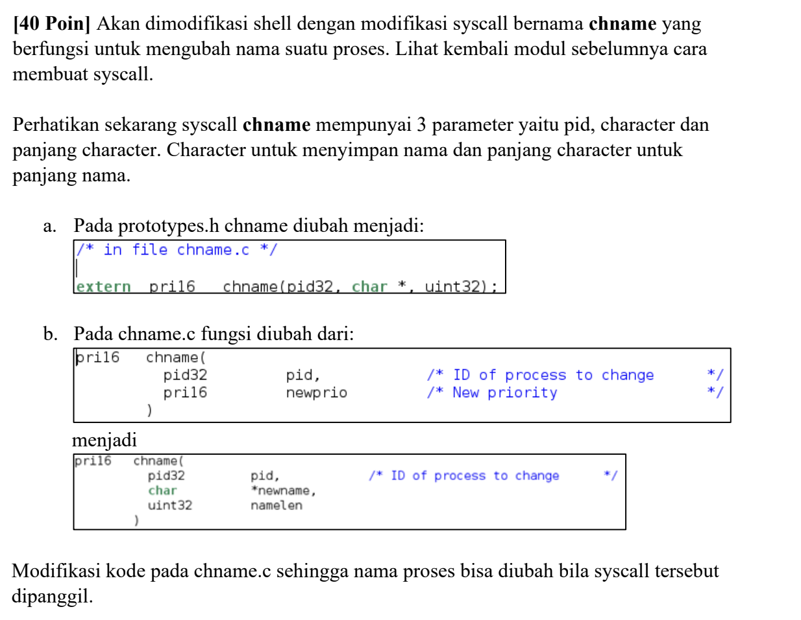
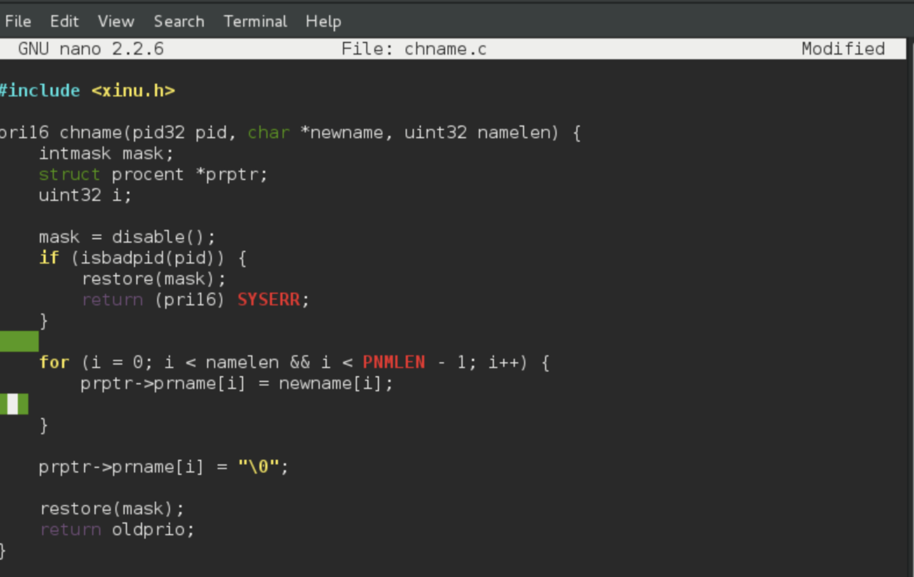
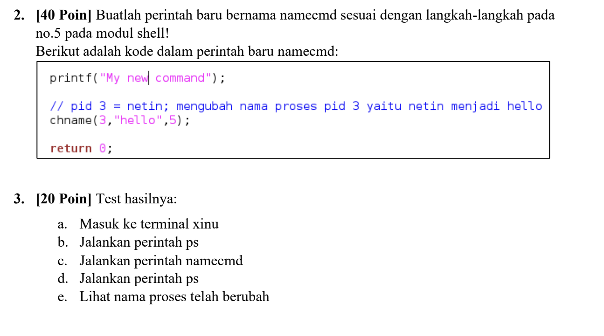
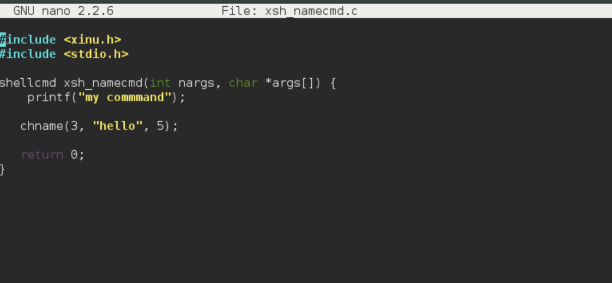
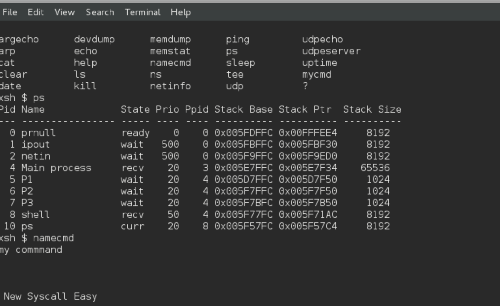

# <h1 align="center">Laporan Praktikum Modul 10 Shell</h1>

Benedictus Qosta Noventino Baru - 2311104029

## Dasar Teori

Shell berfungsi sebagai antarmuka yang menghubungkan pengguna dengan sistem operasi. Tugas utamanya adalah menerjemahkan perintah yang dimasukkan pengguna menjadi instruksi yang dapat dipahami dan dijalankan oleh komputer. Shell bekerja dengan membaca input dari terminal secara terus-menerus dalam sebuah loop. Setelah pengguna menekan tombol Enter, shell akan memproses masukan tersebut dengan mengidentifikasi nama perintah, argumen, serta komponen lain yang diperlukan. Jika proses penguraian (parsing) berhasil, shell akan mengeksekusi perintah sesuai dengan argumen yang diberikan. Sebagai contoh, pada perintah ls -al, shell mengenali ls sebagai nama perintah dan -al sebagai argumen yang menentukan cara perintah tersebut dijalankan.

## Guided

1. Running Development-system yang di VirtualBox
2. Ketik ls pada terminal
3. Download script modul : wget agha.work/modul10.sh
4. Beri permission : chmod +x modul10.sh
5. Jalankan script ./modul10.sh
6. Compile project dengan cd xinu_m10/compile/ lalu make clean setelah itu make
7. Jalankan Xinu dengan sudo minicom
8. Cek syscall baru dengan ketik help
9. Jalankan syscall dengan ketik mycmd

## Unguided

1. 

Nomor 2 & 3

## Referensi

1. (https://telkomuniversityofficial-my.sharepoint.com/personal/maghaz_student_telkomuniversity_ac_id/_layouts/15/onedrive.aspx?id=%2Fpersonal%2Fmaghaz%5Fstudent%5Ftelkomuniversity%5Fac%5Fid%2FDocuments%2F2026%2F00%2E%20Modul%20Praktikum%20Sistem%20Operasi%20SE%202526%2D2%2Epdf&parent=%2Fpersonal%2Fmaghaz%5Fstudent%5Ftelkomuniversity%5Fac%5Fid%2FDocuments%2F2026&ga=1)
