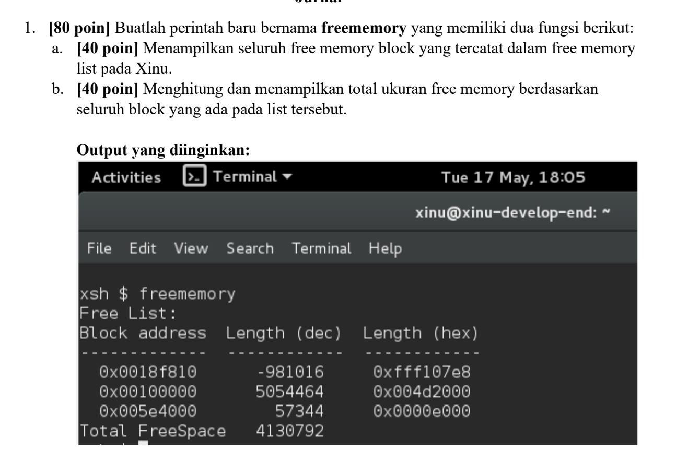
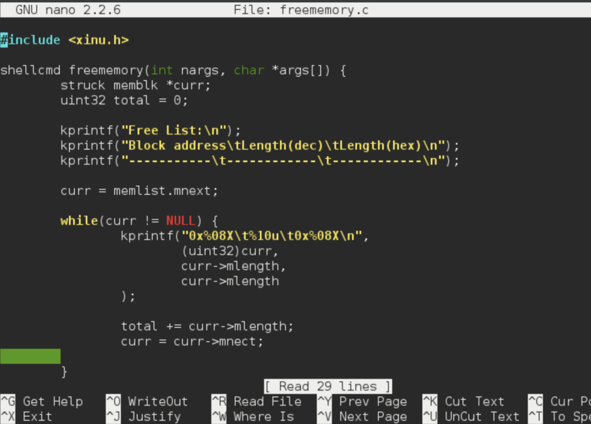
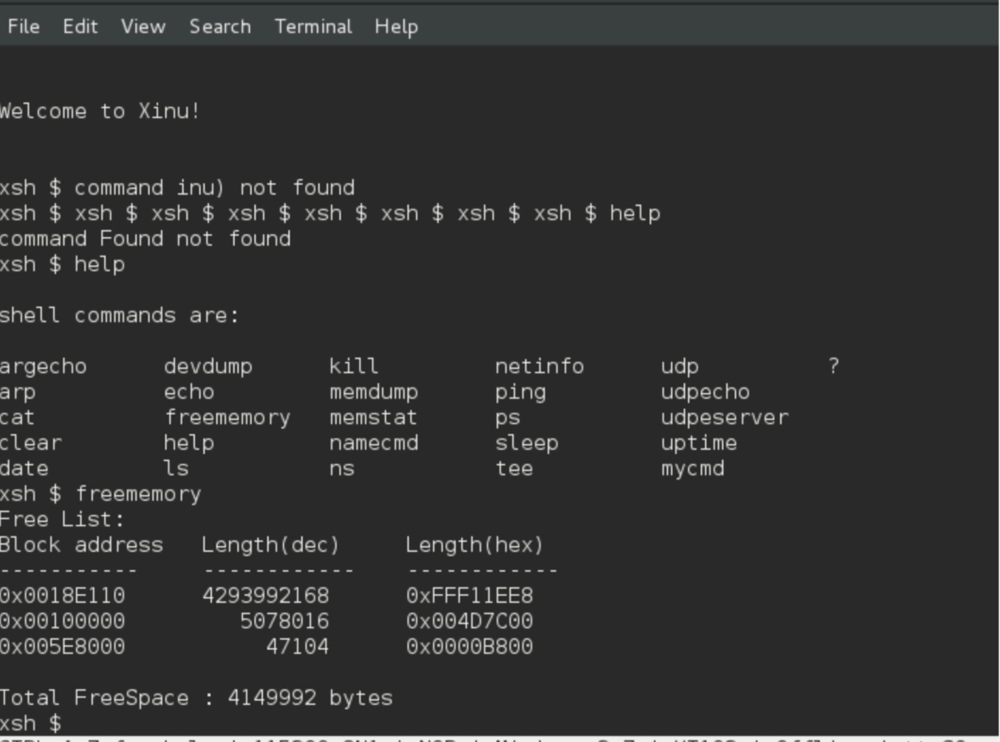
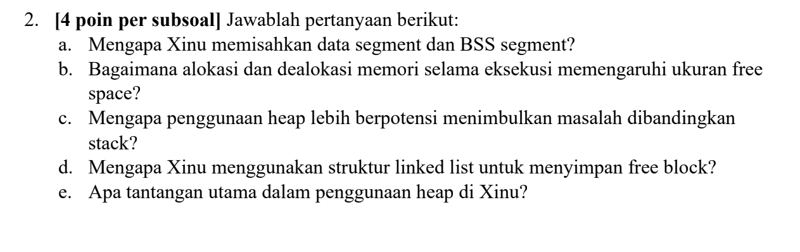

# <h1 align="center">Laporan Praktikum Modul 11 Memori Xinu</h1>

Benedictus Qosta Noventino Baru - 2311104029

## Dasar Teori

Memori dalam program C/C++ merupakan komponen penting yang digunakan untuk menyimpan instruksi dan data selama proses eksekusi berlangsung. Untuk memudahkan pengelolaan, sistem operasi membagi memori program ke dalam beberapa segmen, yaitu code segment, data segment, stack segment, dan heap segment. Code segment berisi instruksi program yang akan dieksekusi, data segment menyimpan variabel global dan variabel statis, stack segment digunakan untuk menyimpan variabel lokal serta informasi pemanggilan fungsi, sedangkan heap segment dimanfaatkan untuk alokasi memori secara dinamis selama program berjalan.

Setiap segmen memori memiliki karakteristik dan kegunaan yang berbeda. Stack menawarkan proses alokasi dan dealokasi yang cepat, tetapi kapasitasnya relatif terbatas. Sebaliknya, heap menyediakan ruang memori yang lebih fleksibel, namun pengelolaannya harus dilakukan secara manual menggunakan fungsi seperti malloc() dan free() atau operator new dan delete. Pemahaman terhadap struktur dan fungsi masing-masing segmen memori sangat penting karena berpengaruh pada efisiensi penggunaan sumber daya, performa program, serta pencegahan berbagai masalah seperti stack overflow dan memory leak. Dengan memahami pengelolaan memori secara baik, programmer dapat mengembangkan aplikasi yang lebih optimal, efisien, dan stabil.

## Guided

Soal 1

Hasil Output

Soal 2

a.
Xinu memisahkan data segment dan BSS segment untuk meningkatkan efisiensi pengelolaan memori. Data segment digunakan untuk menyimpan variabel global maupun statis yang telah memiliki nilai awal, sedangkan BSS segment diperuntukkan bagi variabel global atau statis yang belum diinisialisasi atau bernilai nol. Pemisahan ini memungkinkan sistem menghemat ruang penyimpanan karena nilai nol tidak perlu disimpan secara eksplisit di dalam file program, sehingga ukuran executable menjadi lebih kecil dan proses inisialisasi memori dapat dilakukan dengan lebih efisien.

b.
Proses alokasi memori akan mengambil sebagian ruang kosong yang tersedia sehingga ukuran free space berkurang. Sebaliknya, ketika memori dibebaskan melalui dealokasi, ruang tersebut dikembalikan ke kumpulan memori kosong sehingga free space bertambah. Namun, jika alokasi dan dealokasi terjadi secara berulang dengan ukuran blok yang berbeda-beda, memori kosong dapat terpecah menjadi bagian-bagian kecil yang tidak berdekatan, yang dikenal sebagai fragmentasi memori.

c.
Penggunaan heap memiliki risiko yang lebih tinggi dibandingkan stack karena pengelolaannya dilakukan secara dinamis dan memerlukan kontrol langsung dari programmer. Kesalahan seperti tidak membebaskan memori yang sudah tidak digunakan dapat menyebabkan memory leak. Selain itu, heap juga rentan terhadap fragmentasi, kesalahan penggunaan pointer, maupun akses ke memori yang telah dibebaskan. Sementara itu, stack bekerja secara otomatis mengikuti mekanisme pemanggilan dan pengembalian fungsi, sehingga pengelolaannya lebih sederhana dan terstruktur.

d.
Xinu memanfaatkan struktur linked list untuk menyimpan free block karena setiap blok memori kosong dapat memiliki ukuran dan lokasi yang berbeda-beda. Dengan linked list, blok-blok tersebut dapat dihubungkan melalui pointer tanpa harus tersimpan secara berurutan di memori. Pendekatan ini memudahkan sistem dalam melakukan pencarian, penambahan, penghapusan, maupun penggabungan kembali blok memori kosong selama proses alokasi dan dealokasi berlangsung.

e.
Tantangan terbesar dalam pengelolaan heap di Xinu adalah menjaga penggunaan memori agar tetap efisien dan konsisten selama proses alokasi serta dealokasi. Berbagai masalah dapat muncul, seperti fragmentasi memori, memory leak, kesalahan pointer, maupun kesulitan dalam menggabungkan kembali blok-blok memori kosong yang terpisah. Jika masalah tersebut tidak ditangani dengan baik, sistem dapat mengalami kekurangan memori meskipun masih tersedia ruang kosong yang tersebar di berbagai lokasi memori.

## Referensi

1. (https://telkomuniversityofficial-my.sharepoint.com/personal/maghaz_student_telkomuniversity_ac_id/_layouts/15/onedrive.aspx?id=%2Fpersonal%2Fmaghaz%5Fstudent%5Ftelkomuniversity%5Fac%5Fid%2FDocuments%2F2026%2F00%2E%20Modul%20Praktikum%20Sistem%20Operasi%20SE%202526%2D2%2Epdf&parent=%2Fpersonal%2Fmaghaz%5Fstudent%5Ftelkomuniversity%5Fac%5Fid%2FDocuments%2F2026&ga=1)
