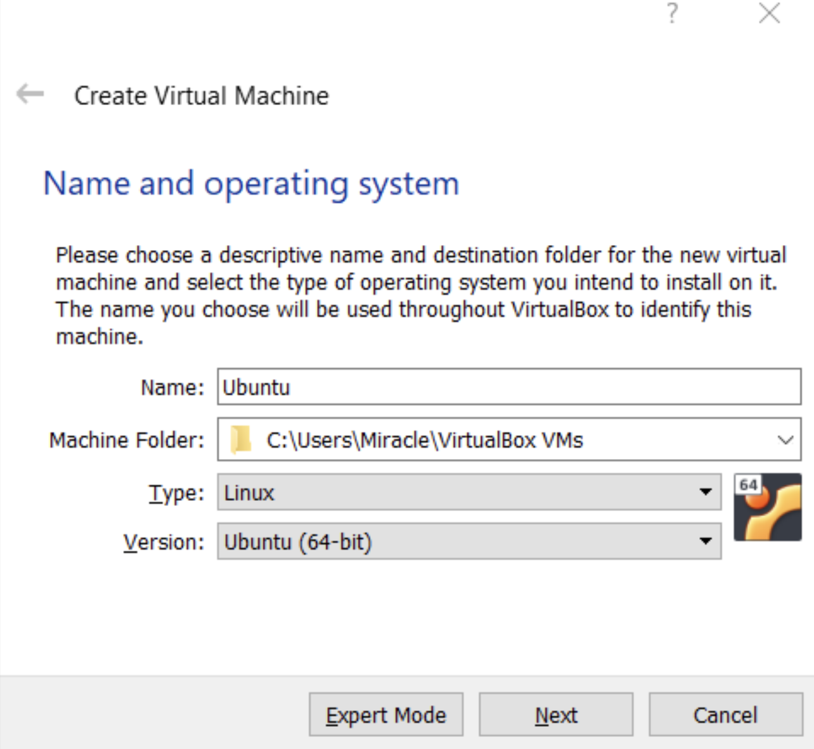
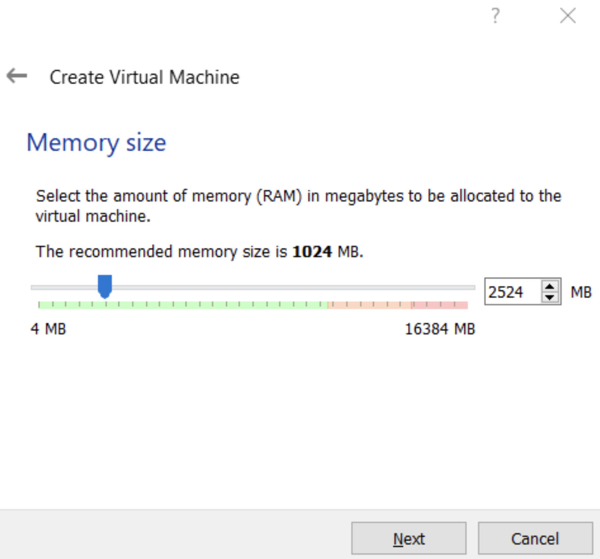
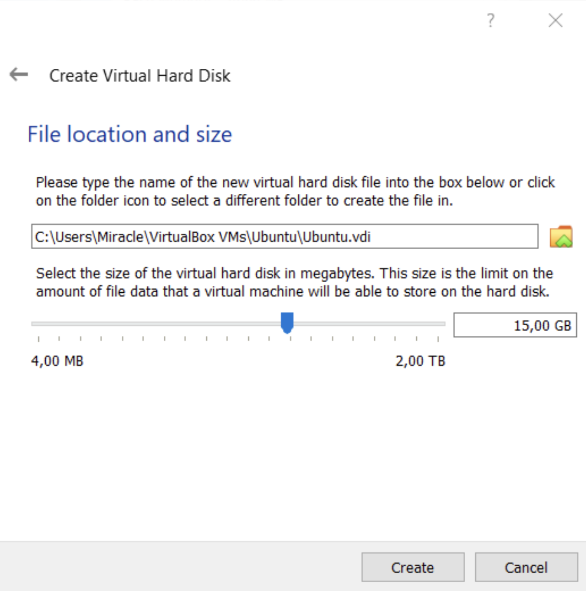
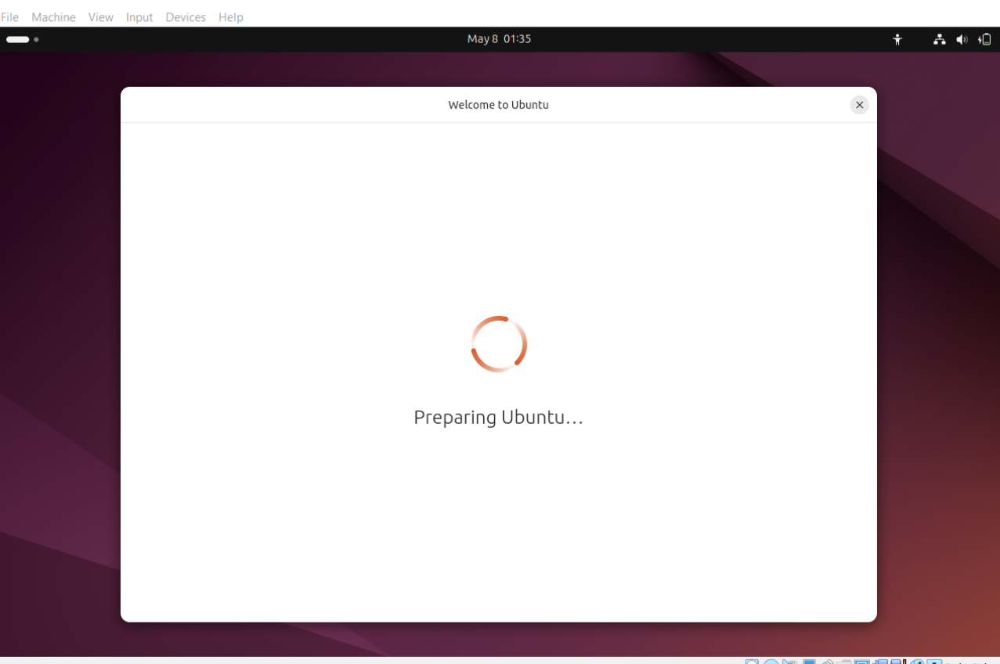
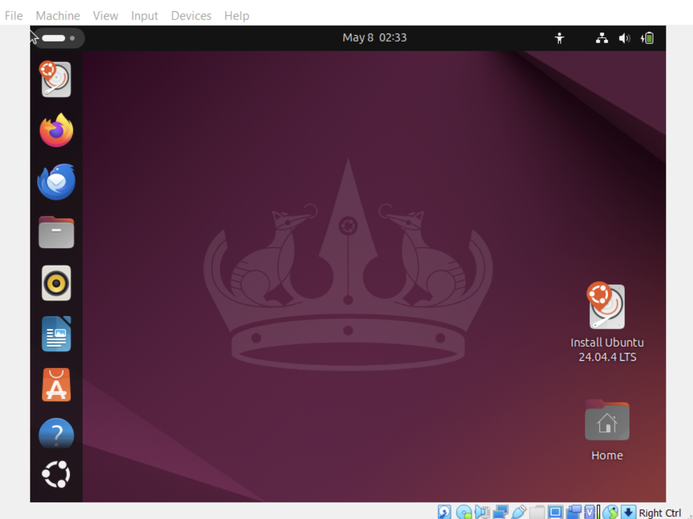
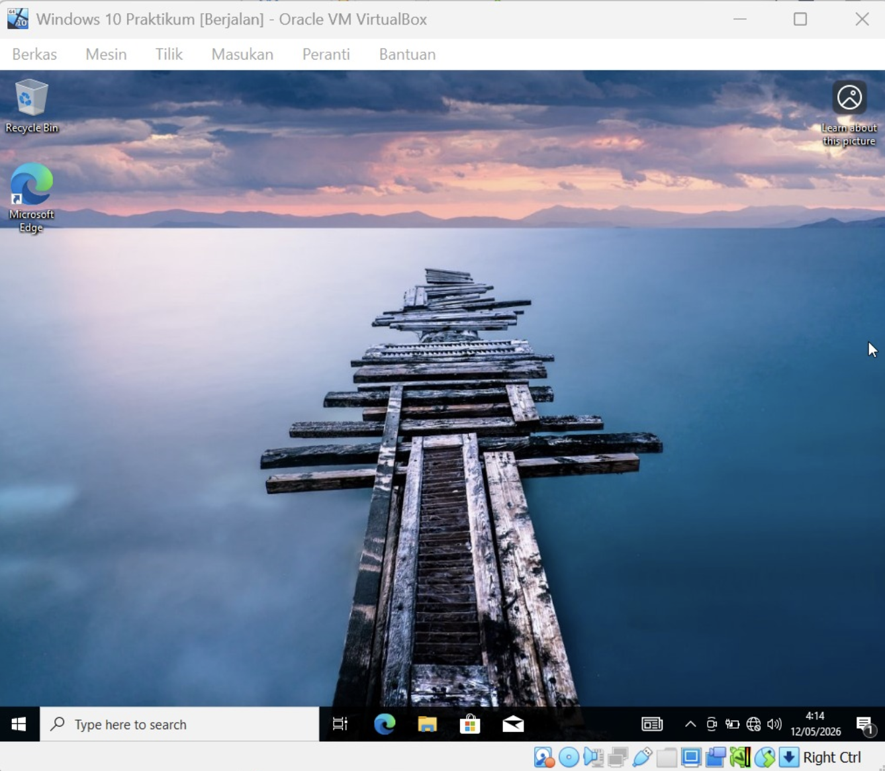
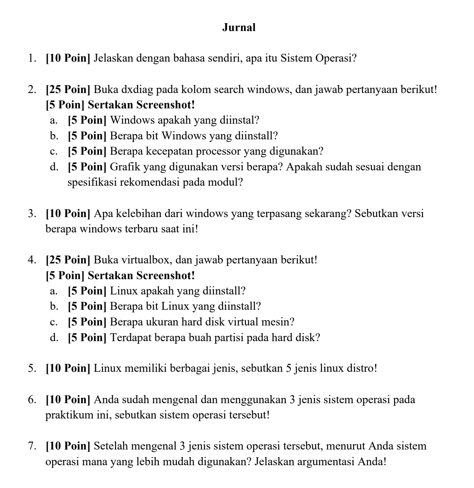

# <h1 align="center">Laporan Praktikum Modul 12 Linux dan Windows</h1>

Benedictus Qosta Noventino Baru - 2311104029

## Dasar Teori

1. Sistem Operasi

Sistem operasi adalah perangkat lunak inti yang berperan sebagai perantara antara pengguna dan perangkat keras komputer. Fungsinya mencakup pengelolaan berbagai sumber daya sistem, seperti CPU, memori, media penyimpanan, serta perangkat input dan output, sehingga seluruh komponen dapat bekerja secara optimal. Selain mengatur sumber daya, sistem operasi juga menyediakan lingkungan yang memungkinkan pengguna menjalankan aplikasi, mengelola data, dan berinteraksi dengan komputer secara lebih mudah. Contoh sistem operasi yang banyak digunakan saat ini adalah Linux dan Microsoft Windows.

2. Pengertian Linux

Linux merupakan sistem operasi open-source yang pertama kali diperkenalkan oleh Linus Torvalds pada tahun 1991. Karena sifatnya yang terbuka, Linux dapat dikembangkan dan dimodifikasi oleh komunitas pengguna di seluruh dunia. Sistem operasi ini dikenal memiliki tingkat keamanan, stabilitas, dan fleksibilitas yang tinggi, sehingga banyak digunakan pada server, komputer desktop, maupun perangkat embedded. Linux mendukung penggunaan antarmuka berbasis Command Line Interface (CLI) dan Graphical User Interface (GUI). Dalam praktik administrasi sistem, terminal atau shell sering digunakan karena memberikan kontrol yang lebih luas melalui perintah teks.

3. Pengertian Windows

Microsoft Windows adalah sistem operasi yang dikembangkan oleh Microsoft dan dikenal dengan antarmuka Graphical User Interface (GUI) yang ramah pengguna. Sistem operasi ini dirancang untuk memudahkan pengguna dalam mengoperasikan komputer, baik untuk kebutuhan sehari-hari maupun profesional. Windows menyediakan berbagai fasilitas penting, seperti pengelolaan file, dukungan jaringan, sistem keamanan, serta kompatibilitas dengan beragam aplikasi dan perangkat keras, sehingga menjadi salah satu sistem operasi paling populer di dunia.

## Guided

Install Ubuntu di VirtualBox

Konfigurasi awal VM Ubuntu

Alokasi Memori dan Prosesor

Pengaturan Virtual Hard Disk

Pemilihan ISO Image

Langkah 5: Proses Instalasi Berjalan

Install Windows 10 di VirtualBox

Langkah-langkah :

1. Buka Oracle VM VirtualBox, klik New, beri nama "Windows 10 Praktikum", dan pilih file ISO Windows 10 yang telah diunduh.
2. Atur kapasitas RAM (disarankan 2GB atau lebih) dan jumlah prosesor.
3. Buat Virtual Harddisk dengan kapasitas minimal 50GB.
4. Jalankan mesin (Start), pilih bahasa dan wilayah, lalu pilih Windows 10 Pro.
5. Pilih opsi Custom: Install Windows only (advanced) dan buat partisi baru pada ruang kosong yang tersedia.
6. Tunggu proses penyalinan file dan loading "Just a moment" hingga muncul layar konfigurasi akun.
7. Buat akun pengguna dengan nama "Shilfi" dan kosongkan password untuk kemudahan akses.
8. Setelah masuk desktop, instal VirtualBox Guest Additions melalui menu 8. Devices > Insert Guest Additions CD Image agar resolusi layar dapat diatur secara otomatis.

## Unguided

1. Jelaskan dengan bahasa sendiri, apa itu Sistem Operasi?

Jawab:
Sistem operasi merupakan perangkat lunak inti yang mengatur dan mengendalikan seluruh sumber daya komputer. Sistem operasi berfungsi sebagai penghubung antara pengguna dan perangkat keras sehingga pengguna dapat menjalankan aplikasi, mengelola file, serta memanfaatkan berbagai perangkat komputer dengan mudah.

2. Buka dxdiag pada kolom Search Windows, lalu jawab pertanyaan berikut!

a. Windows apakah yang diinstal?
Windows 10 Pro.

b. Berapa bit Windows yang diinstal?
64-bit.

c. Berapa kecepatan prosesor yang digunakan?
2,40 GHz.

d. Grafik yang digunakan versi berapa? Apakah sudah sesuai dengan spesifikasi rekomendasi pada modul?
Versi grafik yang digunakan telah memenuhi spesifikasi yang direkomendasikan pada modul sehingga dapat mendukung pelaksanaan praktikum dengan baik.

3. Apa kelebihan dari Windows yang terpasang sekarang? Sebutkan versi Windows terbaru saat ini!

Jawab:
Windows yang digunakan memiliki beberapa keunggulan, seperti antarmuka yang mudah dipahami, kompatibilitas yang luas dengan berbagai aplikasi dan perangkat keras, serta fitur keamanan bawaan seperti Windows Defender yang cukup andal. Selain itu, sistem operasi ini juga mendukung berbagai kebutuhan pengguna, baik untuk pekerjaan maupun pembelajaran. Saat ini, versi Windows terbaru yang tersedia adalah Windows 11.

4. Buka VirtualBox, lalu jawab pertanyaan berikut!

a. Linux apakah yang diinstal?
Ubuntu 24.04 LTS.

b. Berapa bit Linux yang diinstal?
64-bit.

c. Berapa ukuran hard disk virtual mesin?
25 GB.

d. Terdapat berapa partisi pada hard disk?
Secara umum terdapat satu partisi utama yang digunakan sebagai root (/) dan satu partisi tambahan untuk kebutuhan sistem seperti swap atau boot, sehingga total terdapat dua partisi.

5. Linux memiliki berbagai jenis. Sebutkan 5 distro Linux!

Jawab:

Ubuntu
Debian
Kali Linux
Fedora
Linux Mint

6. Anda sudah mengenal dan menggunakan 3 jenis sistem operasi pada praktikum ini. Sebutkan sistem operasi tersebut!

Jawab:

Windows (sistem operasi utama/host)
Windows 10 (virtual machine)
Ubuntu Linux (virtual machine)

7. Setelah mengenal 3 jenis sistem operasi tersebut, menurut Anda sistem operasi mana yang lebih mudah digunakan? Jelaskan alasannya!

Jawab:
Menurut saya, Windows merupakan sistem operasi yang paling mudah digunakan karena tampilannya sudah sangat familiar bagi sebagian besar pengguna. Pengoperasiannya lebih banyak mengandalkan antarmuka grafis (GUI) sehingga pengguna dapat melakukan berbagai aktivitas melalui menu dan klik tanpa harus menghafal banyak perintah. Selain itu, proses instalasi aplikasi dan konfigurasi sistem umumnya lebih sederhana dibandingkan Linux yang dalam beberapa kondisi masih memerlukan penggunaan terminal atau command line.

## Referensi

1. (https://telkomuniversityofficial-my.sharepoint.com/personal/maghaz_student_telkomuniversity_ac_id/_layouts/15/onedrive.aspx?id=%2Fpersonal%2Fmaghaz%5Fstudent%5Ftelkomuniversity%5Fac%5Fid%2FDocuments%2F2026%2F00%2E%20Modul%20Praktikum%20Sistem%20Operasi%20SE%202526%2D2%2Epdf&parent=%2Fpersonal%2Fmaghaz%5Fstudent%5Ftelkomuniversity%5Fac%5Fid%2FDocuments%2F2026&ga=1)
