# <h1 align="center">Laporan Praktikum Modul 14 Scripting</h1>

Benedictus Qosta Noventino Baru - 2311104029

## Dasar Teori

a. Bash

Bash (Bourne-Again Shell) merupakan antarmuka yang menghubungkan pengguna dengan sistem operasi. Ketika pengguna memasukkan perintah melalui terminal, Bash bertugas menerjemahkan dan meneruskan perintah tersebut agar dapat diproses oleh sistem. Selain digunakan secara langsung melalui terminal, Bash juga mendukung otomatisasi tugas melalui file script yang dikenal sebagai bash script. Bash script berisi sekumpulan perintah Linux yang dieksekusi secara berurutan dan umumnya disimpan dengan ekstensi .sh.

b. Struktur Dasar Bash Script

Meskipun terlihat sederhana, sebuah bash script memiliki beberapa komponen penting. Bagian pertama adalah shebang (#!/bin/bash) yang ditempatkan pada baris awal script untuk memberi tahu sistem bahwa file tersebut harus dijalankan menggunakan Bash. Selain itu, terdapat komentar yang diawali dengan tanda #, di mana seluruh teks setelah simbol tersebut tidak akan dieksekusi dan biasanya digunakan untuk memberikan penjelasan pada script. Komponen utama lainnya adalah perintah, yaitu kumpulan instruksi Linux seperti echo, ls, dan berbagai perintah lainnya yang akan dijalankan secara berurutan. Agar sebuah script dapat dieksekusi, pengguna perlu memberikan izin eksekusi terlebih dahulu menggunakan perintah seperti chmod +x namascript.sh, kemudian menjalankannya dengan perintah ./namascript.sh.

## Guided

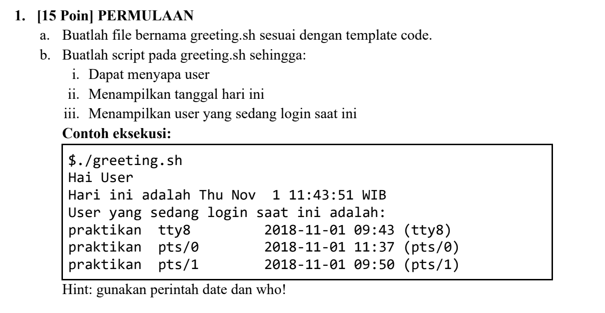
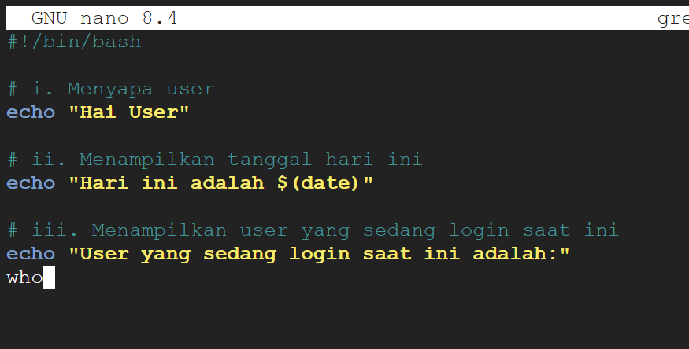
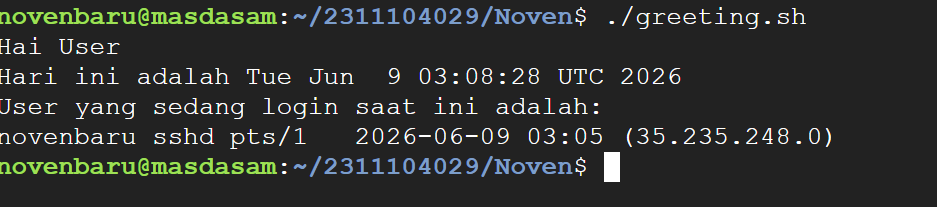

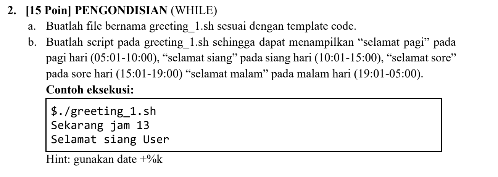
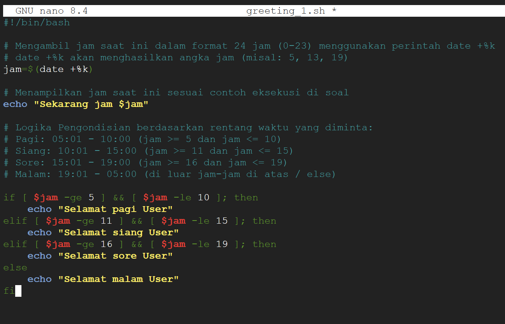
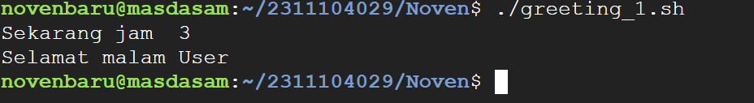

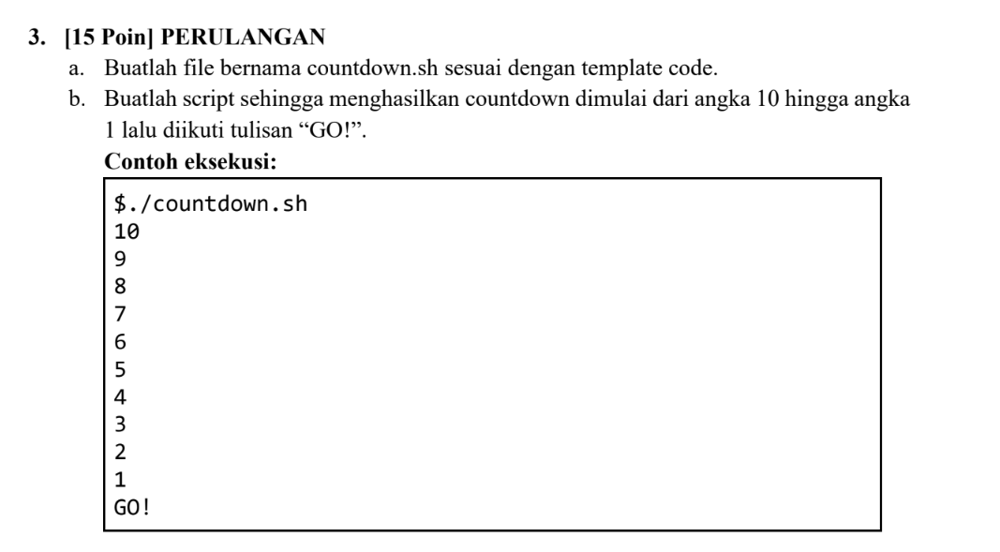
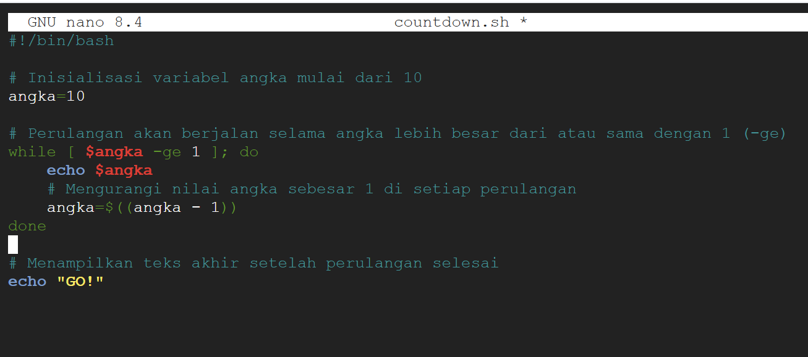
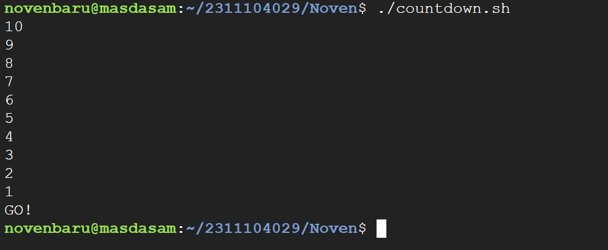

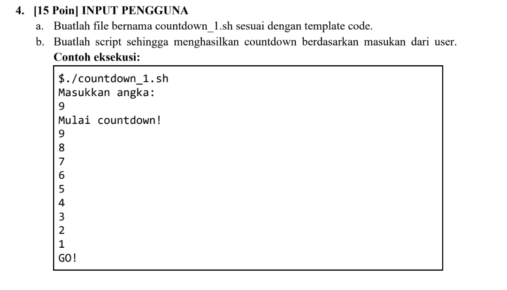
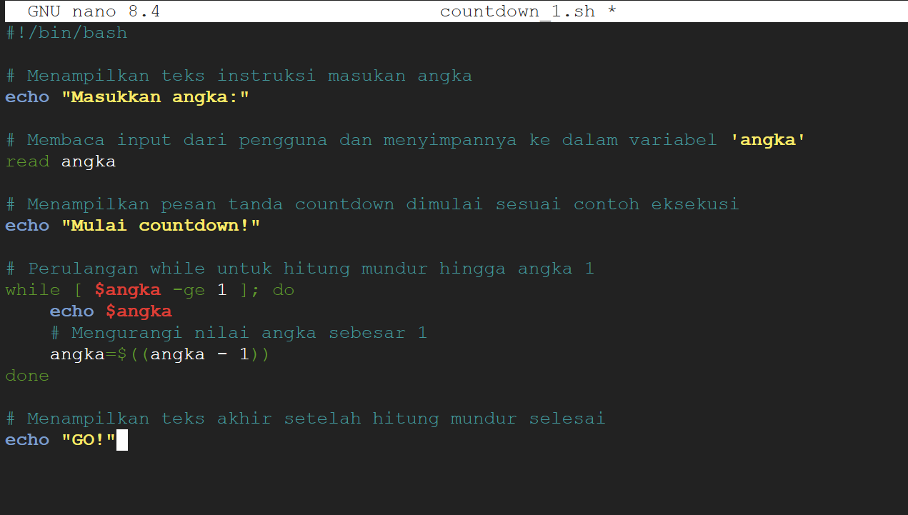
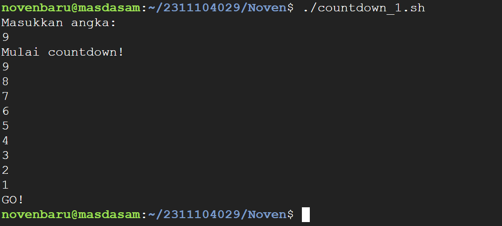

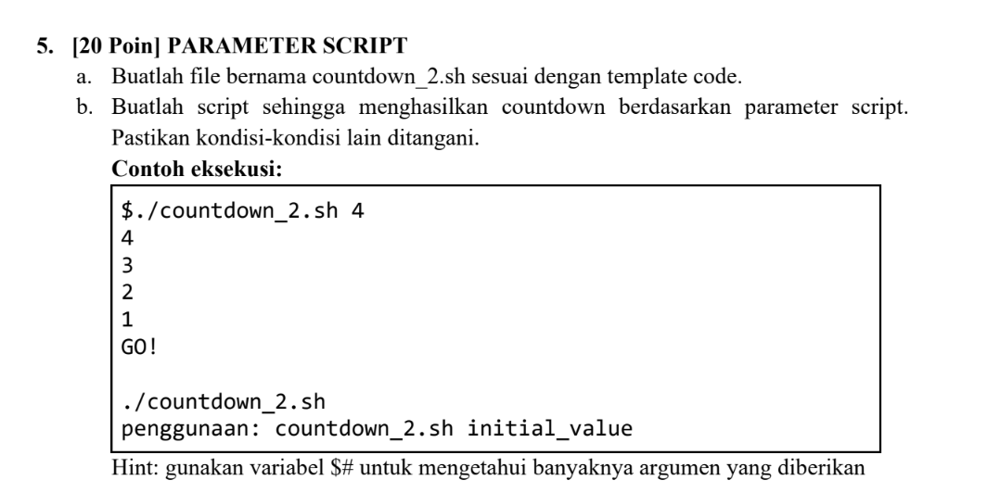
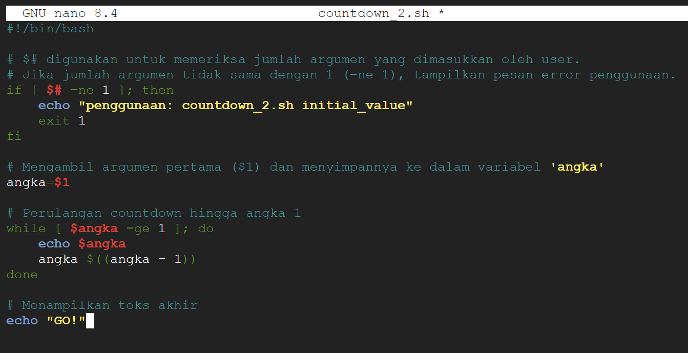
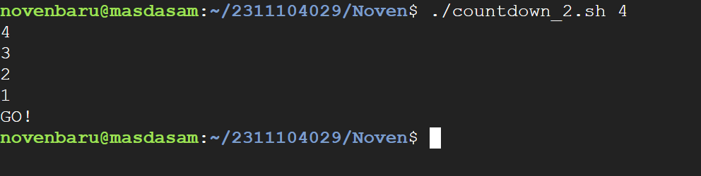

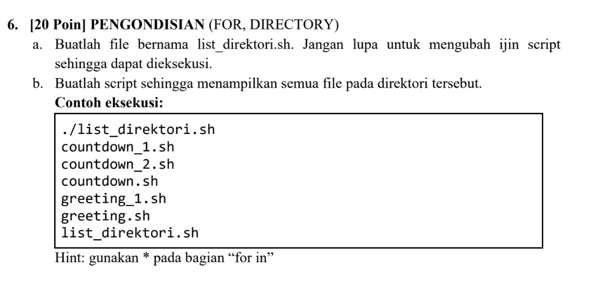
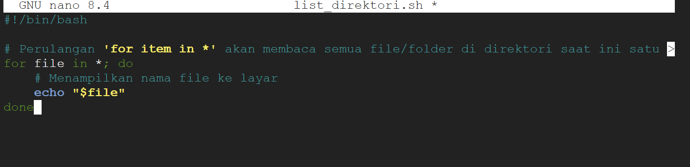
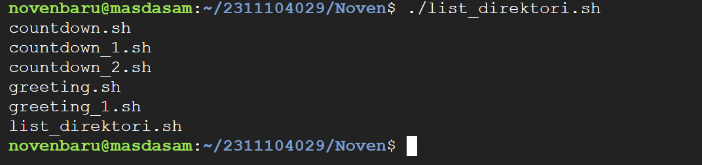

## Referensi

1. (https://telkomuniversityofficial-my.sharepoint.com/personal/maghaz_student_telkomuniversity_ac_id/_layouts/15/onedrive.aspx?id=%2Fpersonal%2Fmaghaz%5Fstudent%5Ftelkomuniversity%5Fac%5Fid%2FDocuments%2F2026%2F00%2E%20Modul%20Praktikum%20Sistem%20Operasi%20SE%202526%2D2%2Epdf&parent=%2Fpersonal%2Fmaghaz%5Fstudent%5Ftelkomuniversity%5Fac%5Fid%2FDocuments%2F2026&ga=1)
